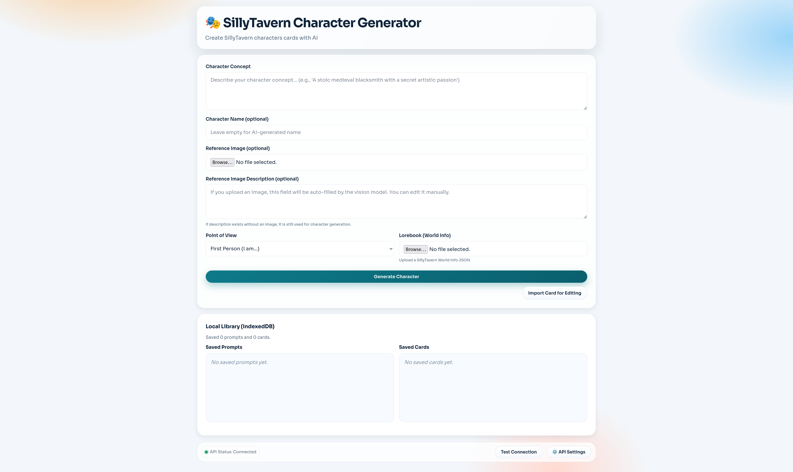
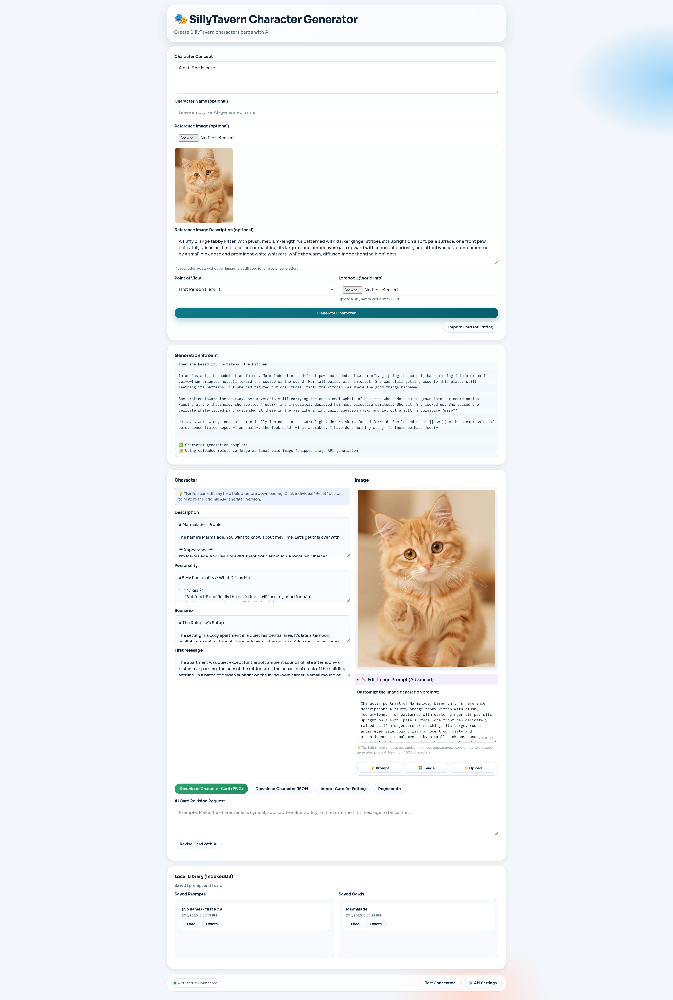

# SillyTavern Character Generator (v2)




Web app for generating, editing, importing, revising, and exporting SillyTavern character cards (Spec V2).

## Features

### Character Generation
- AI character generation from a free-text concept description.
- Optional fixed character name, or let the AI generate one.
- First-person (`I am...`) or third-person (`He/She is...`) POV templates.
- Optional lorebook (SillyTavern World Info JSON) uploaded as grounding context.
- Optional reference image upload — auto-described by a vision model if configured, or manually described.
- Streaming generation output with stop support.

### Import & Edit
- Import existing cards (`.png` with embedded `chara_card_v2` data, or `.json`) and edit them in-place.
- **Import & Remaster** mode: import a card and immediately queue an AI rewrite pass.
- Per-field reset buttons to revert any field back to the last generated or imported baseline.

### AI Revision Tools
- **Revise with AI** — apply a free-text instruction to rewrite the whole card.
- **Reduce Tokens** — AI rewrites the card to be concise and token-efficient, stripping purple prose and bloat.
- **Consistency Check** — AI analyses the card for logical contradictions, tonal mismatches, or continuity errors and produces a report.
- **Auto-Fix** — automatically apply the fixes suggested by the last consistency report.

### Lorebook Manager
- Add, edit, and delete lorebook entries directly in the app (keyword + content pairs).
- AI-powered **Suggest Topics** to surface key nouns from the character profile as lorebook candidates.
- AI **Generate Entry** fills content for a topic, with an optional hint.
- Lorebook is embedded in exported PNG/JSON as `character_book`.

### Alternate Greetings
- Add up to 5 alternate first messages per card.
- Generate a **random** alternate greeting (new scenario) or a **continuation** greeting (picks up after the original scenario).
- Optional hint to guide AI generation.
- Alternate greetings are embedded in the exported card.

### Example Messages Generator
- Generate dialogue examples in SillyTavern `<START>` / `<END>` format.
- Adjustable count (1–5 examples).
- Works with both generated and imported cards.
- Not embedded in exported cards — copy to clipboard for manual import into SillyTavern.

### Image Handling
- AI image-prompt generation (up to 1000 characters), with an editable prompt box.
- Regenerate prompt or regenerate image independently.
- Upload your own image instead.
- CORS-bypass proxy for fetching remote image URLs.

### Library (Server-Side Storage)
- Prompts and cards are saved to the proxy server's `data/` directory (JSON flat files).
- Auto-saved on generation and revision; manual save button also available.
- Load or delete saved prompts and cards from the UI.
- Data persists across restarts when using Docker volumes.

### Export
- Download as SillyTavern PNG card with embedded `chara_card_v2` metadata.
- Download as JSON (`chara_card_v2` structure).

### Token Counter
- Live token-count display for each character field.

---

## Requirements

- Node.js 18+ recommended
- OpenAI-compatible text API endpoint (required)
- OpenAI-compatible image API endpoint (optional)
- Vision-capable text model (optional — only needed for reference-image auto-description)

---

## Quick Start

### Local (Dev)

```bash
npm install
cd proxy && npm install && cd ..
npm run dev
```

- Frontend: `http://localhost:2427`
- Proxy API: `http://localhost:2426`

### Local (Non-dev)

```bash
npm start
```

### Docker Compose

```bash
cp docker-compose.example.yml docker-compose.yml
# Edit docker-compose.yml or create a .env file with your port preferences
docker compose up -d --build
```

- Frontend: `http://localhost:2427` (or the port set by `FRONTEND_PORT`)
- Proxy health: `http://localhost:2426/health` (or the port set by `PROXY_PORT`)

> **Library persistence:** The Docker Compose configuration maps `./proxy/data` to `/app/data` inside the proxy container, so saved cards and prompts survive container restarts.

---

## Configuration

### Environment Variables (`.env` / Docker)

| Variable | Default | Description |
|---|---|---|
| `FRONTEND_PORT` | `2427` | Host port mapped to the frontend container |
| `PROXY_PORT` | `2426` | Host port for the proxy server |
| `FRONTEND_URL` | `http://localhost:2427` | Used by the proxy for CORS and OpenRouter headers |

### In-App API Settings

| Setting | Notes |
|---|---|
| Text API Base URL | OpenAI-compatible endpoint (e.g. `https://api.openai.com/v1`) |
| Text API Key | Passed as `Authorization: Bearer` header |
| Text Model | Model name for generation and revision |
| Vision Model | Optional — used to auto-describe reference images |
| Image API Base URL | Optional — enables image generation |
| Image API Key | Optional |
| Image Model | Optional |
| Image Size | Optional (e.g. `1024x1024`) |
| Persist API keys | Off by default — keys are session-only unless toggled |
| Enable image generation | Toggle to show/hide image controls |

Settings are saved server-side (via `POST /api/config`) so they persist across page reloads.

---

## Usage

1. Open **API Settings** and configure the text API (required).
2. Enter a **Character Concept** and optional fixed name.
3. Optionally upload a **Lorebook JSON** (World Info) for contextual grounding.
4. Optionally upload a **Reference Image** — it will be auto-described if a vision model is set.
5. Click **Generate Character**.
6. Edit any field directly, or use the revision tools (Revise, Reduce Tokens, Consistency Check).
7. Use the **Lorebook Manager** to add world-building entries.
8. Use the **Alt Greetings Manager** to add alternate opening messages.
9. Optionally generate **Example Messages** and copy them to SillyTavern.
10. Click **Download** to export as PNG or JSON.

---

## API Compatibility Notes

- The frontend calls only the local proxy (`/api/...`).
- The proxy forwards requests to your configured upstream API URL.
- Authentication: the proxy tries `Authorization: Bearer <key>` first, then retries with `X-API-Key` on a 401.
- OpenRouter is detected automatically and the required `HTTP-Referer` / `X-Title` headers are added.
- The proxy accepts payloads up to 50 MB to support base64-encoded vision requests.

---

## Project Structure

```
index.html                  — UI shell
src/
  scripts/
    main.js                 — App controller and event binding
    app-ui.js               — UI helpers (notifications, streaming, state buttons)
    character-generator.js  — Character prompt templates and response parsing
    character-display.js    — Field display, edit, reset, import
    revision-handler.js     — AI revision, token reduction, consistency check/auto-fix
    alt-greetings-handler.js — Alternate greetings CRUD and AI generation
    lorebook-handler.js     — Lorebook entry CRUD and AI topic/entry generation
    library-handler.js      — Save/load/delete prompts & cards from the library
    image-handler.js        — Image generate/upload, reference image, model fetch
    image-generator.js      — Image prompt generation logic
    lorebook-generator.js   — Lorebook AI generation (standalone module)
    png-encoder.js          — Embed chara_card_v2 metadata into PNG files
    api.js                  — APIHandler base (request, streaming, retry, abort)
    api-character.js        — Character generation and prompt-building methods
    api-image.js            — Image generation methods
    api-lorebook.js         — Lorebook/alt-greeting/consistency API methods
    config.js               — Config management (localStorage + server sync)
    storage.js              — Server-side library storage (cards and prompts)
  styles/
    main.css                — Application styles
proxy/
  server.js                 — Express proxy (text, image, config, library, CORS)
  data/
    cards.json              — Saved card library
    prompts.json            — Saved prompt library
    config.json             — Persisted API settings
```

---

## License

MIT. See `LICENSE`.
