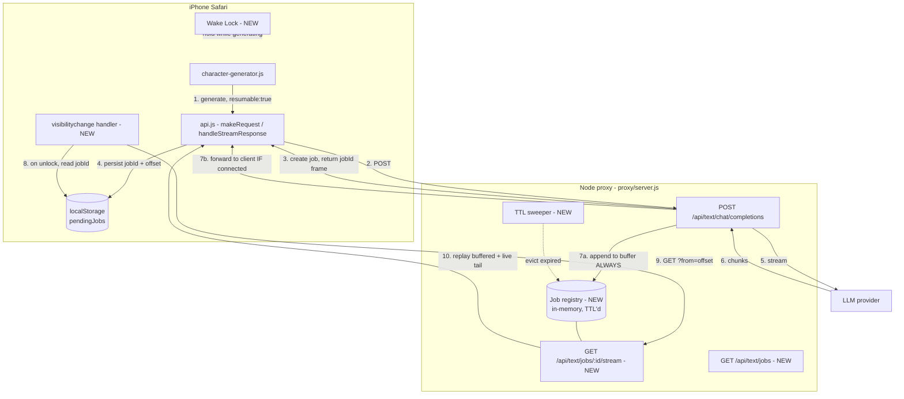

# CardGen Mobile Resilience — Implementation Plan

## Overview

Make Character Generator survive an iPhone locking mid-generation, by buffering
generation server-side and resuming it when the phone unlocks.

Roleplay Chat, Story Writer and Adventure were all built with phone use in mind
and already survive this. Character Generator predates that work and does not.
This plan ports the proven pattern across, without rewriting CardGen onto the
Python backend.

---

## The problem, precisely

A CardGen generation is a single streaming HTTP request:

```
iPhone Safari  →  nginx (NPM/TLS)  →  Node proxy  →  LLM provider
```

Nothing is persisted anywhere along that path. The assembled character exists
only in browser memory as SSE frames arrive. If iOS tears the socket down while
the phone is locked, the in-flight generation is unrecoverable — the tokens are
spent and the character is gone.

Two consequences observed in the current code:

1. **Silent re-generation.** `api.js:56` retries a failed request up to 3 times.
   On unlock the retry fires and starts a *completely new* generation, so the
   user gets a different character than the one that was streaming — at double
   the token cost, with no indication anything was discarded.
2. **No recovery path.** There is no `visibilitychange` handler in the CardGen
   path (unlike `chat-handler.js:321`, `adventure-handler.js:88`,
   `storywriter.js:523`), so nothing even attempts to pick work back up.

### Why the other three features are immune

The pattern has two halves, and CardGen has neither:

| | Detached generation | Wake re-sync |
|---|---|---|
| Roleplay Chat | `chat.py:1165` `asyncio.create_task(generate_task())` | `chat-handler.js:321` |
| Story Writer | `generation.py:156` `asyncio.create_task(read_llm())` | `storywriter.js:523` |
| Adventure | `adventure.py` background task | `adventure-handler.js:88` |
| **CardGen** | **none — bytes are piped straight through** | **none** |

Because generation is detached from the HTTP response *and* the result is
committed to Postgres, the Python backend finishes the job whether or not anyone
is listening. On unlock, `syncOnWake()` re-fetches and the message is simply
there.

CardGen needs the equivalent: somewhere for the result to land, and something
that goes back for it.

---

## Architecture



The essential change: **the upstream read loop writes into the job buffer
unconditionally**, and forwarding to the client becomes a best-effort side
effect rather than the only destination.

---

## Server design — proxy/server.js

### Job registry

In-memory `Map` keyed by job id. Deliberately not persisted: a generation lasts
under a minute, and a proxy restart during one is rare and acceptable. (If that
proves wrong, the existing `/api/storage` layer is the natural upgrade path —
noted under Future Work, not built now.)

```js
// jobId -> record
{
  id:            "uuid",
  userId:        7,              // ownership; enforced on resume
  status:        "running" | "done" | "error",
  content:       "",             // assembled text so far
  finishReason:  null,           // "stop" | "length" | ...
  error:         null,
  createdAt:     1730000000000,
  completedAt:   null,
  subscribers:   0,              // currently attached clients
}
```

### Bounds (all required — this is unbounded memory otherwise)

| Limit | Value | Why |
|---|---|---|
| Max concurrent running jobs per user | 8 | "Generate 4" uses 4 at once; leaves headroom |
| Max buffered content per job | 1 MB | A card is ~10 KB; 1 MB is a runaway guard |
| Retention after terminal state | 10 min | Long enough for a phone left locked |
| Hard cap on running duration | 20 min | Matches the 10-min upstream timeout with slack |
| Sweep interval | 60 s | Evict expired records |

Exceeding the per-job content cap terminates the job with
`status: "error"` rather than growing without limit.

### Endpoint changes

**`POST /api/text/chat/completions`** — gains an opt-in `resumable: true` body
flag. Existing callers are completely unaffected.

When `resumable` is set:

1. Create a job record, emit `data: {"type":"job","jobId":"..."}` as the **first**
   SSE frame so the client can persist it before any content arrives.
2. The upstream `data` handler appends to `job.content` first, then attempts
   `res.write()` only if the client is still attached.
3. **Do not abort on client disconnect.** The `res.on("close")` handler added in
   the previous change is amended: it aborts only when the job is
   non-resumable. For resumable jobs it decrements `subscribers` and lets
   generation run to completion into the buffer.
4. On upstream completion, set `status`/`finishReason`/`completedAt`.

Non-resumable requests keep the abort-on-disconnect behaviour, so the token-waste
protection is retained everywhere it isn't actively harmful.

**`GET /api/text/jobs/:jobId/stream?from=<offset>`** — NEW. Resume endpoint.

- 404 if unknown/evicted; 403 if `job.userId !== req.user.userId`.
- Immediately replays `job.content.slice(from)` as a single SSE frame.
- If `status === "running"`, stays attached and streams subsequent chunks live.
- If terminal, emits a `done` frame (with `finishReason`) and closes.

`offset` is a **character count of assembled content**, not a chunk index — it
survives differing chunk boundaries between the original and resumed streams.

**`GET /api/text/jobs`** — NEW. Lists the caller's non-expired jobs
(`id`, `status`, `createdAt`, content length). This is the safety net for when
Safari discards the tab entirely and localStorage is the only surviving state,
or when the stored jobId is stale.

---

## Client design — src/scripts/api.js

All changes are contained in the shared request layer, so individual CardGen
callers (`character-generator.js`, `batch-generator.js`, `revision-handler.js`)
need no modification beyond opting in.

### Tracking

On receiving the `job` frame, record in `localStorage` under `cardgen.pendingJobs`:

```js
{ jobId, offset: 0, startedAt, label: "Character generation" }
```

`localStorage` rather than `sessionStorage` deliberately — it survives a full
tab discard and reload, which is exactly the iOS memory-pressure case.

Update `offset` as content is appended. Remove the entry on terminal completion.

### Resume

Register a `visibilitychange` handler mirroring the existing `syncOnWake()`
pattern. When the document becomes visible and a pending job exists:

1. `GET /api/text/jobs/:id/stream?from=<offset>`.
2. Feed the replayed content through the *same* `onStream` callback the original
   request used, so the UI continues filling in as if never interrupted.
3. On 404 (evicted), drop the entry and surface a clear message rather than
   silently starting a new generation.

### Fixing the retry interaction

`makeRequest`'s retry loop (`api.js:56`) must consult the pending-job store
before retrying. If the failed request has a jobId, **resume instead of
re-generating**. This removes the silent double-generation described above and
is arguably the single highest-value fix in this plan — it is a live cost bug
today, independent of phone locking.

---

## Wake Lock (independent, small, do first)

Confirmed viable: the app is served over HTTPS via nginx proxy manager, so
`navigator.wakeLock` is available (iOS 16.4+).

- Acquire `navigator.wakeLock.request('screen')` when a generation starts.
- Release when it ends.
- Re-acquire on `visibilitychange` — browsers auto-release the lock whenever the
  page is hidden, so it must be reclaimed on return.
- Feature-detect and no-op silently where unsupported.

This reduces how often resume is needed but cannot replace it: it does not stop
a manual power-button press, and it is not a correctness guarantee.

---

## Phasing

Each phase is independently shippable and useful on its own.

| Phase | Scope | Files | Risk |
|---|---|---|---|
| 0 | Wake Lock during generation | `api.js` or `main.js` | Very low — additive, feature-detected |
| 1 | Job registry, buffer-always, resume + list endpoints | `proxy/server.js` | Low — gated behind `resumable`, no existing behaviour changes |
| 2 | Client jobId tracking + `visibilitychange` resume | `api.js` | Medium — touches the shared stream path |
| 3 | Retry consults jobs → resume instead of re-generate | `api.js` | Medium — fixes the double-generation cost bug |
| 4 | Opt CardGen callers into `resumable` | `character-generator.js`, `batch-generator.js` | Low |
| 5 | Non-streaming calls (tags, names) via job polling | `api.js` | Low — short calls, least valuable, do last |

Recommended stopping point if effort is constrained: **Phases 0–3**. That
delivers the resilience and fixes the cost bug. Phase 4 is a one-line opt-in per
caller, Phase 5 is optional polish.

---

## Edge cases and decisions

- **"Generate 4" batch.** Produces four concurrent jobs. The pending-job store is
  an array, and resume iterates it. The per-user cap of 8 accommodates this.
- **New generation started while one is pending.** Abandon the stale entry
  explicitly (and let its job expire) rather than resuming into the wrong UI.
- **Job completed while away.** Resume returns the whole remaining content in one
  frame and closes. The user sees the finished character appear on unlock.
- **Job evicted before return** (phone locked > 10 min). Resume 404s; tell the
  user the generation expired instead of silently regenerating. Retention is
  tunable if 10 minutes proves too short in practice.
- **Two devices, same account.** Ownership is per-user, not per-session, so a job
  started on the phone can be reclaimed on the desktop. This is a feature, but
  worth confirming it is wanted before relying on it.
- **nginx buffering.** SSE requires `proxy_buffering off`. Streaming already
  works through NPM today, so the existing config is fine — but the new resume
  endpoint is also SSE and inherits the same requirement.
- **Proxy restart** loses in-flight jobs. Acceptable given the time window; the
  client should treat a 404 on resume identically to eviction.

---

## Testing

Reusing the harness already proven against this stack (fake upstream inside the
proxy container, minted JWT, Playwright at iPhone viewports):

1. **Disconnect mid-stream** → job continues to completion; `GET /jobs/:id`
   returns the full content. Verifies the core premise.
2. **Resume offset correctness** → resume at various offsets, assert the
   concatenation exactly equals a single uninterrupted generation. No gaps, no
   duplicated text.
3. **Resume while still running** → replayed prefix plus live tail arrive in
   order.
4. **Ownership** → user B receives 403 for user A's job.
5. **Eviction** → expired job returns 404 and the client reports expiry rather
   than regenerating.
6. **Memory bounds** → per-job cap terminates cleanly; sweeper reclaims records.
7. **Non-resumable unchanged** → disconnect still aborts upstream (guards the
   cost fix from regressing).
8. **Real iOS check** → lock the phone mid-generation, unlock after ~60s, confirm
   the character completes. The one thing the headless harness cannot prove.

---

## Out of scope

- Migrating CardGen onto the Python backend. Far larger, and unnecessary — the
  job buffer achieves the same resilience at a fraction of the change surface.
- Persisting jobs to Postgres. In-memory is sufficient for a sub-minute
  operation; revisit only if proxy restarts during generation become a real
  annoyance.
- Resumable image generation. Different endpoint, different failure profile,
  and images are already returned as URLs rather than streams.
