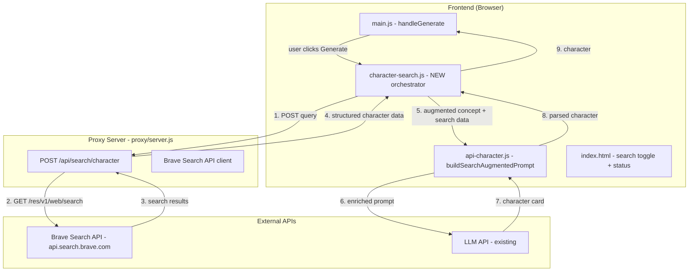

# Character Web Search Feature — Implementation Plan

## Overview

Add a feature where users type a real person's name or a film/TV character and the application searches the web (via Brave Search API) for canonical details about that person/character, then feeds those structured search results into the existing LLM character generation pipeline to produce an accurate character card capturing physical appearance, personality, and scenario.

The user can optionally toggle web search on/off — when off, the existing concept-based flow works exactly as before.

---

## Architecture Diagram



---

## User Flow

1. User types a concept like `"Tony Stark from Iron Man"` or `"Beyonce"` into the existing Character Concept textarea
2. A new **"🔍 Search Web for Details"** checkbox/toggle sits near the concept input (default: **on**)
3. User clicks **Generate** (or **Generate 4** for batch)
4. If search is enabled:
   - The proxy server performs a Brave Search API query with multiple targeted searches (see search strategy below)
   - Results are aggregated and returned as structured JSON with sections: physical appearance, personality, biography, key facts
   - The structured data is woven into the existing LLM character prompt as context
   - The LLM generates a character card faithful to the real person/character
5. If search is disabled: behaves exactly as today — pure LLM generation from concept
6. A small status indicator shows search progress (e.g., "🔍 Searching...", "✅ Found details", "⚠️ No results found — generating from concept only")

---

## Search Strategy

Instead of a single search, we perform multiple targeted queries and merge results:

### Query 1: Wikipedia / Bio
```
"{name}" Wikipedia biography personality physical appearance
```
Used to get canonical biographical data, physical description, personality traits.

### Query 2: Fandom / Wiki (for fictional characters)
```
"{name}" fandom wiki appearance personality backstory
```
Used to get fandom-curated data for fictional characters from movies/TV/games.

### Query 3: Images (optional future enhancement)
```
"{name}" portrait appearance
```
Returns image results — could be shown as reference, but NOT used for generation directly.

### Aggregation Strategy
- Take top 3 results from each query
- Extract text snippets (Brave API returns `description` fields)
- Concatenate into one structured context block:
  ```
  [WEB SEARCH RESULTS for "Tony Stark"]
  
  BIOGRAPHICAL INFO:
  - (snippets from Wikipedia/bio search)
  
  PHYSICAL APPEARANCE:
  - (filtered snippets about looks)
  
  PERSONALITY:
  - (filtered snippets about character traits)
  
  KEY FACTS:
  - (notable trivia, quotes, relationships)
  ```
- This is appended to the user's concept in the prompt

---

## Files to Create/Modify

| File | Action | Description |
|------|--------|-------------|
| `proxy/server.js` | MODIFY | Add `POST /api/search/character` endpoint + Brave Search client functions |
| `.env.example` | MODIFY | Add `BRAVE_SEARCH_API_KEY` and `BRAVE_SEARCH_ENABLED` |
| `src/scripts/character-search.js` | **NEW** | `CharacterSearch` class — orchestrates search + generation flow |
| `index.html` | MODIFY | Add search toggle checkbox, search status indicator in input section |
| `src/scripts/api-character.js` | MODIFY | Add `buildSearchAugmentedPrompt()` method on `APIHandler` prototype |
| `src/scripts/main.js` | MODIFY | Wire search flow into `handleGenerate()`, import new script |
| `src/styles/main.css` | MODIFY | Add search toggle and status indicator styles |
| `docker-compose.yml` | MODIFY | Pass `BRAVE_SEARCH_API_KEY` env var to proxy service |
| `Dockerfile.proxy` | MODIFY | (No changes needed — env vars are read at runtime) |

---

## Detailed Implementation Steps

### Step 1: Add Brave Search API to proxy/server.js

Add a new endpoint and helper functions:

```javascript
// ── Character Web Search ─────────────────────────────────────────────────────
// Brave Search API base URL
const BRAVE_SEARCH_URL = "https://api.search.brave.com/res/v1/web/search";
const BRAVE_SEARCH_API_KEY = process.env.BRAVE_SEARCH_API_KEY || "";
const BRAVE_SEARCH_ENABLED = process.env.BRAVE_SEARCH_ENABLED !== "false" && !!BRAVE_SEARCH_API_KEY;

/**
 * POST /api/search/character
 * Body: { name: string, isFictional: boolean }
 * Response: { 
 *   success: true,
 *   results: { biographical: string, appearance: string, personality: string, keyFacts: string, sourceUrls: string[] }
 * }
 */
app.post("/api/search/character", requireAuth, async (req, res) => {
  // ... implementation detailed below
});

/**
 * Perform a single Brave Web Search query
 */
async function braveWebSearch(query, count = 5) {
  // ... calls Brave Search API with X-Subscription-Token header
}

/**
 * Aggregate multiple search queries into structured character data
 */
async function searchCharacterDetails(name, isFictional = false) {
  // ... runs 2-3 targeted queries, merges results
}
```

**Location in file**: After the URL import endpoint (around line 1768), before the HTML parser functions.

**Brave Search API call format**:
```
GET https://api.search.brave.com/res/v1/web/search?q={query}&count=5&search_lang=en
Headers:
  Accept: application/json
  Accept-Encoding: gzip
  X-Subscription-Token: {BRAVE_SEARCH_API_KEY}
```

**Response parsing**: Extract `.web.results[].title`, `.web.results[].description`, `.web.results[].url`.

### Step 2: Add configuration to .env.example

```bash
# ── Brave Search API ─────────────────────────────────────────────────────────
# Get your free API key at https://brave.com/search/api/
BRAVE_SEARCH_API_KEY=
# Set to "false" to disable web search even if API key is set
BRAVE_SEARCH_ENABLED=true
```

### Step 3: Create src/scripts/character-search.js

This is the frontend orchestrator. It:

1. Checks if search toggle is enabled
2. Calls `POST /api/search/character` via the proxy
3. Takes the structured search results
4. Calls `apiHandler.generateCharacter()` with the search-augmented concept
5. Falls back gracefully to normal generation if search fails

```javascript
// Character Search Module — web search augmentation for character generation
class CharacterSearch {
  constructor() {
    this.apiHandler = null;
    this.lastSearchResults = null;
    this.searchEnabled = true;
  }

  get apiHandlerInstance() {
    if (!this.apiHandler) this.apiHandler = window.apiHandler;
    return this.apiHandler;
  }

  /**
   * Generate a character with optional web search augmentation.
   * Falls back to normal generation if search fails or is disabled.
   */
  async generateCharacter(concept, characterName, onStream, pov, lorebook, cardType) {
    const shouldSearch = this.searchEnabled && !this._isGenericConcept(concept);
    
    if (!shouldSearch) {
      // Normal generation path — no search
      const charGen = window.characterGenerator;
      return charGen.generateCharacter(concept, characterName, onStream, pov, lorebook, cardType);
    }

    // Determine the search name: use characterName if provided, else extract from concept
    const searchName = characterName || this._extractNameFromConcept(concept);
    
    if (!searchName || searchName.length < 2) {
      // Can't meaningfully search — fall back
      const charGen = window.characterGenerator;
      return charGen.generateCharacter(concept, characterName, onStream, pov, lorebook, cardType);
    }

    try {
      // Perform web search
      const isFictional = this._detectIfFictional(concept);
      const searchResults = await this._performSearch(searchName, isFictional);
      this.lastSearchResults = searchResults;
      
      // Build augmented concept
      const augmentedConcept = this._buildAugmentedConcept(concept, searchResults);
      
      // Use the search-augmented prompt path
      return await this.apiHandlerInstance.generateCharacterWithSearch(
        augmentedConcept,
        characterName,
        searchResults,
        onStream,
        pov,
        lorebook,
        cardType
      );
    } catch (error) {
      console.warn("Web search failed, falling back to normal generation:", error);
      const charGen = window.characterGenerator;
      return charGen.generateCharacter(concept, characterName, onStream, pov, lorebook, cardType);
    }
  }

  /**
   * Heuristic: is this a generic concept ("a stoic blacksmith") vs a specific person/character?
   */
  _isGenericConcept(concept) {
    const genericPatterns = [
      /^a\s+/i,           // "a stoic blacksmith"
      /^an\s+/i,          // "an elven archer"
      /^create\s+/i,      // "create a wizard"
      /^generate\s+/i,
    ];
    return genericPatterns.some(p => p.test(concept.trim()));
  }

  /**
   * Try to extract a name from the concept if no explicit name given
   */
  _extractNameFromConcept(concept) {
    // Heuristic: first 2-3 words before "from", "the", or a comma
    const trimmed = concept.trim();
    // "Tony Stark from Iron Man" → "Tony Stark"
    const fromMatch = trimmed.match(/^(.+?)\s+from\s+/i);
    if (fromMatch) return fromMatch[1].trim();
    // Just take first few words as potential name
    const words = trimmed.split(/\s+/);
    return words.slice(0, 3).join(" ");
  }

  /**
   * Heuristic: does the concept mention a work of fiction?
   */
  _detectIfFictional(concept) {
    const fictionIndicators = [
      /\bfrom\b/i, /\bmovie\b/i, /\bfilm\b/i, /\bseries\b/i,
      /\bshow\b/i, /\banime\b/i, /\bgame\b/i, /\bbook\b/i,
      /\bnovel\b/i, /\bcomic\b/i, /\bmarvel\b/i, /\bdc\b/i,
      /\bcharacter\b/i, /\bplayed by\b/i, /\bportrayed\b/i,
      /\bactor\b/i, /\bactress\b/i,
    ];
    return fictionIndicators.some(p => p.test(concept));
  }

  async _performSearch(name, isFictional) {
    const authToken = window.cardgenAuth ? window.cardgenAuth.getToken() : "";
    const response = await fetch("/api/search/character", {
      method: "POST",
      headers: {
        "Content-Type": "application/json",
        "Authorization": `Bearer ${authToken}`,
      },
      body: JSON.stringify({ name, isFictional }),
    });
    if (!response.ok) throw new Error(`Search failed: ${response.status}`);
    const data = await response.json();
    if (!data.success) throw new Error(data.error || "Search returned no results");
    return data.results;
  }

  _buildAugmentedConcept(originalConcept, searchResults) {
    let augmented = originalConcept;
    augmented += "\n\n[The following verified details about this person/character were found via web search. Use them to ensure accuracy.]\n";
    if (searchResults.biographical) augmented += `\nBIOGRAPHY:\n${searchResults.biographical}`;
    if (searchResults.appearance) augmented += `\nPHYSICAL APPEARANCE:\n${searchResults.appearance}`;
    if (searchResults.personality) augmented += `\nPERSONALITY:\n${searchResults.personality}`;
    if (searchResults.keyFacts) augmented += `\nKEY FACTS:\n${searchResults.keyFacts}`;
    return augmented;
  }
}

// Attach to window
window.characterSearch = new CharacterSearch();
```

### Step 4: Modify index.html — Add Search Toggle UI

Add a search toggle in the input section, near the concept textarea. Place it in the form-row with card type / POV / lorebook, or as a standalone row right after the concept textarea:

```html
<!-- After the character-concept textarea, inside the input-section-details -->
<div class="form-row" style="display: flex; gap: 1rem; margin-bottom: 1rem; align-items: center; flex-wrap: wrap;">
    <div class="form-group" style="margin-bottom: 0; display: flex; align-items: center; gap: 0.5rem;">
        <label class="search-toggle" style="display: flex; align-items: center; gap: 0.5rem; cursor: pointer; user-select: none;">
            <input type="checkbox" id="search-web-toggle" checked style="width: 1.1rem; height: 1.1rem; cursor: pointer;" />
            <span style="font-size: 0.9rem; font-weight: 500; color: var(--text-primary);">🔍 Search Web for Details</span>
        </label>
        <span id="search-status" style="font-size: 0.8rem; color: var(--text-secondary); display: none;"></span>
    </div>
</div>
```

### Step 5: Modify src/scripts/api-character.js — Add Search-Augmented Prompt

Add a new method `generateCharacterWithSearch` and `buildSearchAugmentedPrompt`:

```javascript
// In the Object.assign(APIHandler.prototype, { ... }) block:

async generateCharacterWithSearch(
  prompt, characterName, searchResults, onStream, pov, lorebook, cardType
) {
  const characterPrompt = this.buildSearchAugmentedPrompt(
    prompt, characterName, searchResults, pov, lorebook, cardType
  );
  // ... same as generateCharacter() from here — reuse the same request/send logic
  const model = this.config.get("api.text.model") || "glm-4-6";
  const data = {
    model,
    messages: [
      { role: "system", content: characterPrompt.systemPrompt },
      { role: "user", content: characterPrompt.userPrompt },
    ],
    temperature: 0.8,
    max_tokens: 8192,
    stream: !!onStream,
  };
  // ... identical rest of generateCharacter body
},

buildSearchAugmentedPrompt(concept, characterName, searchResults, pov, lorebook, cardType) {
  // Call the existing buildCharacterPrompt to get the base prompts
  const basePrompt = this.buildCharacterPrompt(concept, characterName, pov, lorebook, cardType);
  
  // Inject search results into the system prompt with high-priority instructions
  const searchContextBlock = `
---

**🔍 VERIFIED CHARACTER DETAILS (from web search):**

The following details about this character/person were found via web search. **You MUST use these verified details as the ground truth for your generation.** Do not contradict or invent alternative facts where these details exist.

${searchResults.biographical ? `**Biographical / Background:**\n${searchResults.biographical}\n` : ""}
${searchResults.appearance ? `**Physical Appearance:**\n${searchResults.appearance}\n` : ""}
${searchResults.personality ? `**Personality / Character Traits:**\n${searchResults.personality}\n` : ""}
${searchResults.keyFacts ? `**Key Facts / Notable Details:**\n${searchResults.keyFacts}\n` : ""}

**IMPORTANT:** Use these verified details for accuracy. If the character is a fictional character from a specific work, set the scenario in that universe. If it's a real person, ground the character in reality.

---`;

  // Insert the search context after the CRITICAL MACRO RULE paragraph (before the template)
  // Find the insertion point: right before "### **Character Profile Template**"
  const insertionPoint = basePrompt.systemPrompt.indexOf("### **Character Profile Template**");
  if (insertionPoint !== -1) {
    basePrompt.systemPrompt = 
      basePrompt.systemPrompt.slice(0, insertionPoint) + 
      searchContextBlock + "\n" +
      basePrompt.systemPrompt.slice(insertionPoint);
  } else {
    basePrompt.systemPrompt += searchContextBlock;
  }

  return basePrompt;
},
```

### Step 6: Modify src/scripts/main.js — Wire Up Search Flow

**In `bindEvents()`**:
- Add toggle change handler for `#search-web-toggle`
- Add click handler on `#search-web-toggle` label to toggle `window.characterSearch.searchEnabled`

**In `handleGenerate()`**:
Replace the direct `this.characterGenerator.generateCharacter(...)` call with `window.characterSearch.generateCharacter(...)`:

```javascript
// OLD:
this.currentCharacter = await this.characterGenerator.generateCharacter(
  effectiveConcept, characterName,
  (token, fullContent) => this.handleCharacterStream(token, fullContent),
  pov, this.lorebookData, cardType,
);

// NEW:
this.currentCharacter = await window.characterSearch.generateCharacter(
  effectiveConcept, characterName,
  (token, fullContent) => this.handleCharacterStream(token, fullContent),
  pov, this.lorebookData, cardType,
);
```

**Search status updates**:
Before calling generate, show "🔍 Searching web..." in the status indicator. After search completes, show "✅ Found: 12 details". If search fails, show "⚠️ Search unavailable — generating from concept".

**Load character-search.js**: Ensure `src/scripts/character-search.js` is loaded in index.html after `api-character.js` but before `main.js`.

### Step 7: Add CSS to src/styles/main.css

```css
/* ── Search Toggle ─────────────────────────────────────────────────────────── */

.search-toggle {
  display: inline-flex;
  align-items: center;
  gap: 0.5rem;
  padding: 0.4rem 0.75rem;
  border-radius: 0.375rem;
  background: var(--surface-muted);
  border: 1px solid var(--border);
  transition: background var(--transition), border-color var(--transition);
}

.search-toggle:hover {
  background: var(--surface);
  border-color: var(--accent);
}

.search-toggle input[type="checkbox"] {
  accent-color: var(--accent);
}

#search-status {
  display: inline-flex;
  align-items: center;
  gap: 0.25rem;
  font-size: 0.8rem;
  padding: 0.2rem 0.5rem;
  border-radius: 0.25rem;
}

#search-status.searching {
  color: var(--accent);
  animation: pulse 1.5s ease-in-out infinite;
}

#search-status.found {
  color: #28a745;
}

#search-status.not-found {
  color: #ffc107;
}

#search-status.error {
  color: #dc3545;
}

@keyframes pulse {
  0%, 100% { opacity: 1; }
  50% { opacity: 0.5; }
}
```

### Step 8: Update docker-compose.yml and Dockerfile.proxy

**docker-compose.yml** (proxy service):
```yaml
proxy:
  build:
    context: .
    dockerfile: Dockerfile.proxy
  environment:
    - BRAVE_SEARCH_API_KEY=${BRAVE_SEARCH_API_KEY:-}
    - BRAVE_SEARCH_ENABLED=${BRAVE_SEARCH_ENABLED:-true}
  # ... rest unchanged
```

Also add to the top-level `environment` or `.env` file reference.

### Step 9: Add search-only mode toggle

The checkbox `#search-web-toggle` in the UI already serves this purpose. Additionally:
- When search is toggled off, the `CharacterSearch.generateCharacter()` method immediately delegates to the normal path
- No network requests are made
- No search status is shown

---

## Error Handling Strategy

| Scenario | Behavior |
|----------|----------|
| Brave API key not configured | Search endpoint returns 503; frontend falls back to normal generation with a silent warning |
| Brave API rate limited (429) | Proxy returns 429; frontend shows "⚠️ Search rate limited" and falls back |
| Search returns 0 results | Proxy returns `{ success: true, results: null }`; frontend shows "No details found" and falls back |
| Search times out (>10s) | Proxy aborts; frontend falls back gracefully |
| Concept is generic (no specific person) | `_isGenericConcept()` returns true; search is skipped entirely |
| User disables search toggle | No search attempted; normal generation |

---

## Security Considerations

- The Brave Search API key lives **only** on the proxy server — never exposed to the browser
- The search endpoint requires authentication (same `requireAuth` middleware as other endpoints)
- Search queries are sanitized — only the `name` parameter is forwarded to Brave; the full concept is never sent
- Response size is capped
- The proxy's existing rate limiting / auth protects the search endpoint

---

## Testing Plan

1. **Basic search**: Enter "Tony Stark from Iron Man" → verify accurate appearance, personality, scenario set in Marvel universe
2. **Real person**: Enter "Beyonce" → verify biographical accuracy, physical description matches reality
3. **Generic concept (search skipped)**: Enter "a stoic blacksmith" → verify search is not triggered, normal generation works
4. **Search toggle OFF**: Uncheck toggle, enter "Harry Potter" → verify no search request, normal LLM generation
5. **Search failure fallback**: Temporarily set invalid API key → verify graceful fallback
6. **Batch generation**: Click "Generate 4" with search enabled → verify search runs once, results shared across all variants

---

## Dependencies

- **Brave Search API key** — the "Search" plan (not "Answers") from https://brave.com/search/api/. Provides 1,000 free queries/month via the `/res/v1/web/search` endpoint. At low usage (a few character searches per day), this stays within the free tier. Requires one-click signup — no credit card for the free plan.
- No new npm packages required — the proxy already uses `node-fetch` for HTTP requests
- No new frontend dependencies
