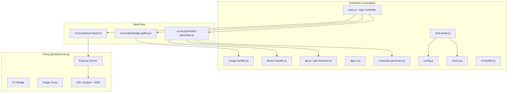

# Feature Enhancement Implementation Plan

## Overview

Four features to implement:

1. **Batch Generation + Favourite Picker** — Generate N card variants from one concept, compare in a grid, pick the best
2. **Improved Chat Tester** — Temperature/top_p sliders, save/load transcripts, persona selector, lorebook trigger highlighting
3. **Image Gallery / Lightbox** — Full-screen image viewer with zoom, prev/next, keyboard nav
4. **Import from JanitorAI & Chub.ai URLs** — Paste a character URL, scrape and convert to Spec V2

---

## Architecture Diagram



---

## Feature 1: Batch Generation + Favourite Picker

### User Flow
1. User fills in concept, name, POV, card type, lorebook, reference image as normal
2. User clicks new "**Generate N Variants**" dropdown button (default: 3)
3. App generates N full character cards in parallel (streaming shown for first only; others silently generated)
4. A **Batch Comparison Modal** opens showing all N results in a grid:
   - Each card shows: name, description snippet, personality snippet, scenario snippet, first message snippet
   - Click a card to see full details in a side panel
   - Click "⭐ Pick This" to select that variant as the active character
5. Selected variant becomes `this.currentCharacter`; other results are discarded
6. Selected variant is auto-saved to library

### Files to Create/Modify

| File | Action | Description |
|------|--------|-------------|
| `src/scripts/batch-generator.js` | **NEW** | BatchGenerator class + UI methods added to CharacterGeneratorApp prototype |
| `index.html` | MODIFY | Add batch generation button, batch comparison modal HTML |
| `src/styles/main.css` | MODIFY | Add batch grid/comparison modal styles |
| `src/scripts/main.js` | MODIFY | Wire up batch generation button event |

### Key Design Decisions

- **Parallel vs Sequential**: Generate all N cards in parallel using `Promise.all`. The streaming display shows the first card's stream; others use a non-streaming path (`stream: false`).
- **Seed control**: Each variant uses a different random seed passed as `seed` parameter to the text generation API for deterministic variation. If the text API doesn't support seed, skip it.
- **Abort handling**: If user clicks Stop, abort all in-flight requests via AbortController.
- **Memory**: Store all N character objects temporarily; discard N-1 when user picks.
- **API Cost**: Show estimated token count per variant before confirming.

### BatchComparisonModal HTML Structure (added to index.html)
```html
<div id="batch-modal" class="modal-overlay">
  <div class="api-settings-modal" style="max-width: min(95vw, 1400px); width: 95%; max-height: 92vh;">
    <div class="modal-header">
      <h2 class="modal-title">🎭 Choose Your Favourite</h2>
      <button id="batch-modal-close-btn" class="modal-close">×</button>
    </div>
    <div class="modal-body">
      <div id="batch-loading" style="text-align:center;padding:2rem;">
        <div class="loading-spinner"></div>
        <p>Generating 3 variants...</p>
        <p id="batch-progress" style="font-size:0.875rem;color:var(--text-secondary);"></p>
      </div>
      <div id="batch-grid" style="display:grid;grid-template-columns:repeat(auto-fit,minmax(350px,1fr));gap:1rem;"></div>
      <div id="batch-detail" style="display:none;margin-top:1rem;padding:1rem;background:var(--surface-muted);border-radius:0.5rem;"></div>
    </div>
  </div>
</div>
```

### API Method Changes
- Add `generateCharacterSilent()` to `api-character.js`: same as `generateCharacter()` but with `stream: false`
- Add `generateBatchCharacters()` to `api-character.js`: calls `generateCharacterSilent` N times in parallel

---

## Feature 2: Improved Chat Tester

### User Flow
1. Open Chat Tester as before
2. New toolbar with:
   - **Temperature slider** (0.1–2.0, default 0.85)
   - **Top-P slider** (0.1–1.0, default 1.0)
   - **Max Tokens input** (50–2000, default 800)
   - **Save Transcript** button → saves to IndexedDB
   - **Load Transcript** button → shows saved transcript list
   - **Persona selector** → dropdown of saved personas
3. Lorebook trigger words highlighted in the chat UI when they appear in user messages
4. Transcripts saved to localStorage with name, date, character name
5. Personas stored in localStorage (name + optional description)

### Files to Create/Modify

| File | Action | Description |
|------|--------|-------------|
| `src/scripts/chat-tester.js` | MODIFY | Add temperature, top_p, max_tokens to prompt; add save/load transcript methods; add persona storage |
| `src/scripts/chat-ui.js` | MODIFY | Add toolbar controls, transcript list modal, lorebook highlight rendering |
| `index.html` | MODIFY | Add chat toolbar controls (sliders), transcript list modal, persona manager UI |
| `src/styles/main.css` | MODIFY | Add chat toolbar styles, transcript modal styles |

### Key Design Decisions

- **Temperature/Top-P**: Passed in the `data` object to `makeRequest()`. The proxy already forwards all body params.
- **Transcripts**: Stored in `localStorage` keyed as `chatgen_transcript_<timestamp>`. Each entry: `{name, characterName, messages[], createdAt}`. List them in a modal with Load/Delete actions.
- **Personas**: Stored in `localStorage` as `chatgen_personas` array. Each: `{name, description}`. Simple add/edit/delete CRUD.
- **Lorebook highlighting**: When rendering chat messages, scan the text for lorebook keys (case-insensitive) and wrap matches in `<span class="lorebook-highlight">` with a tooltip showing the lorebook entry name. Use a subtle underline style.

### Chat Toolbar HTML (added to chat-tester-modal)
```html
<div class="chat-toolbar-params" style="display:flex;gap:1rem;align-items:center;flex-wrap:wrap;padding:0.5rem 0;border-top:1px solid var(--border);margin-top:0.5rem;">
  <label>Temp: <input type="range" id="chat-temperature" min="0.1" max="2.0" step="0.1" value="0.85" style="width:80px;"> <span id="chat-temp-value">0.85</span></label>
  <label>Top-P: <input type="range" id="chat-top-p" min="0.1" max="1.0" step="0.05" value="1.0" style="width:80px;"> <span id="chat-top-p-value">1.0</span></label>
  <label>Max Tokens: <input type="number" id="chat-max-tokens" min="50" max="2000" step="50" value="800" style="width:70px;"></label>
  <button id="chat-save-transcript-btn" class="btn-outline btn-small">💾 Save</button>
  <button id="chat-load-transcript-btn" class="btn-outline btn-small">📂 Load</button>
  <button id="chat-manage-personas-btn" class="btn-outline btn-small">👤 Personas</button>
</div>
```

---

## Feature 3: Image Gallery / Lightbox

### User Flow
1. When image generation results appear (from "Regenerate", "Generate 4 Models", "Generate 4 Variations", or Free Image), each image has a **magnifying glass icon** overlay
2. Click the icon → full-screen lightbox opens with:
   - Large image display (respects viewport)
   - **Zoom** (mouse wheel or +/- buttons)
   - **Pan** (click-drag on zoomed image)
   - **Previous/Next** arrows (when multiple images in gallery)
   - **Keyboard**: ← → for nav, Escape to close, +/- for zoom
   - **Download** button
   - **Use This** button (sets as card image)
   - Image metadata (model, prompt snippet)
3. Works for ALL image result modals (regenerate single, 4 models, 4 variations, free image)

### Files to Create/Modify

| File | Action | Description |
|------|--------|-------------|
| `src/scripts/image-gallery.js` | **NEW** | ImageGallery class with lightbox rendering, zoom/pan, keyboard nav |
| `index.html` | MODIFY | Add lightbox overlay HTML |
| `src/styles/main.css` | MODIFY | Add lightbox, zoom, nav arrow styles |
| `src/scripts/image-handler.js` | MODIFY | Add magnifying glass icon to each image card; wire click to open gallery |

### Key Design Decisions

- **Reuse existing image data**: The image results already flow through `image-handler.js` as arrays of `{url, prompt, model, label, index}`. The gallery receives this array.
- **Zoom**: CSS `transform: scale()` on the `` element. Track scale factor (1x–5x).
- **Pan**: On zoomed image, track mouse drag offset with `translate()`.
- **Touch support**: Pinch-to-zoom via `touchmove` event and two-finger gesture detection.
- **Blob URL cleanup**: Revoke blob URLs when gallery closes and images are not selected.

### Lightbox HTML (added to index.html)
```html
<div id="gallery-lightbox" class="gallery-overlay">
  <div class="gallery-toolbar">
    <button id="gallery-close-btn" class="gallery-btn">✕</button>
    <button id="gallery-zoom-in-btn" class="gallery-btn">＋</button>
    <button id="gallery-zoom-out-btn" class="gallery-btn">－</button>
    <button id="gallery-download-btn" class="gallery-btn">⬇</button>
    <button id="gallery-use-btn" class="gallery-btn gallery-use-btn">✓ Use This</button>
    <span id="gallery-counter" class="gallery-counter">1/4</span>
  </div>
  <button id="gallery-prev-btn" class="gallery-nav gallery-nav-prev">❮</button>
  <button id="gallery-next-btn" class="gallery-nav gallery-nav-next">❯</button>
  <div id="gallery-image-container" class="gallery-image-container">
    
  </div>
  <div id="gallery-meta" class="gallery-meta"></div>
</div>
```

---

## Feature 4: Import from JanitorAI & Chub.ai URLs

### User Flow
1. New button in the top import area: "**🌐 Import from URL**"
2. Click → modal with URL input field
3. Paste a JanitorAI character URL (e.g. `https://janitorai.com/characters/abc123`) or Chub.ai URL (e.g. `https://chub.ai/characters/username/char-name`)
4. Click "Fetch" → proxy scrapes the page, extracts character data
5. Shows a preview of what was extracted (name, description, personality, etc.)
6. Click "Import" → character is loaded into the editor just like a file import
7. The imported card can then be edited, remastered, or downloaded

### Files to Create/Modify

| File | Action | Description |
|------|--------|-------------|
| `proxy/server.js` | MODIFY | Add `POST /api/import/url` endpoint that fetches and parses character data from JanitorAI/Chub.ai |
| `src/scripts/url-import.js` | **NEW** | URL import modal UI and API call methods, added to CharacterGeneratorApp prototype |
| `index.html` | MODIFY | Add "Import from URL" button, URL import modal HTML |
| `src/styles/main.css` | MODIFY | Add URL import modal styles |
| `src/scripts/main.js` | MODIFY | Wire up URL import button event |

### Proxy Implementation (`POST /api/import/url`)

The proxy handles the scraping because:
- CORS restrictions prevent browser-side scraping
- Some sites require specific headers or cookies
- We want to centralize HTML parsing logic

```
POST /api/import/url
Body: { url: string }
Response: { 
  success: true, 
  character: { name, description, personality, scenario, firstMessage, tags[], ... } 
}
```

#### JanitorAI Strategy
1. Fetch the page HTML at the provided URL
2. Look for `<script id="__NEXT_DATA__" type="application/json">` — this contains the full character data as JSON
3. Parse the JSON, extract character fields
4. Map JanitorAI fields to Spec V2 fields:
   - `character.name` → `name`
   - `character.description` / `character.personality` → `description` + `personality`
   - `character.scenario` → `scenario`
   - `character.firstMessage` / `character.intro` → `firstMessage`
   - `character.tags` → `tags`

#### Chub.ai Strategy
1. Fetch the page HTML
2. Look for `<script id="__NEXT_DATA__" type="application/json">` or embedded JSON-LD
3. Alternative: Try Chub's API endpoint if discoverable in page source
4. Map Chub fields similarly to Spec V2

#### Fallback Strategy (both sites)
If structured data not found:
1. Parse HTML with regex/cheerio-like approach (using simple string parsing since we don't have cheerio)
2. Extract `<meta>` tags (og:title, og:description)
3. Extract visible text content from known CSS class patterns
4. Return whatever partial data we can extract with a `partial: true` flag

### URL Import Modal HTML (added to index.html)
```html
<div id="url-import-modal" class="modal-overlay">
  <div class="api-settings-modal" style="max-width: 600px; width: 92%;">
    <div class="modal-header">
      <h2 class="modal-title">🌐 Import Character from URL</h2>
      <button id="url-import-modal-close-btn" class="modal-close">×</button>
    </div>
    <div class="modal-body">
      <p style="font-size:0.875rem;color:var(--text-secondary);margin-bottom:1rem;">
        Paste a character page URL from JanitorAI or Chub.ai
      </p>
      <input id="url-import-input" type="url" placeholder="https://janitorai.com/characters/..." class="content-box" style="width:100%;padding:0.6rem 0.75rem;margin-bottom:0.75rem;">
      <button id="url-import-fetch-btn" class="btn-primary" style="width:100%;">Fetch Character</button>
      <div id="url-import-status" style="margin-top:0.75rem;font-size:0.875rem;"></div>
      <div id="url-import-preview" style="display:none;margin-top:1rem;">
        <h3 id="url-import-preview-name" style="margin:0 0 0.5rem;"></h3>
        <div id="url-import-preview-desc" style="font-size:0.875rem;color:var(--text-secondary);max-height:200px;overflow-y:auto;padding:0.5rem;background:var(--surface-muted);border-radius:0.375rem;white-space:pre-wrap;"></div>
        <div style="display:flex;gap:0.5rem;margin-top:1rem;">
          <button id="url-import-confirm-btn" class="btn-primary" style="flex:1;">Import into Editor</button>
          <button id="url-import-cancel-btn" class="btn-outline">Cancel</button>
        </div>
      </div>
    </div>
  </div>
</div>
```

### Security Considerations
- The proxy validates URLs against a whitelist of allowed domains (`janitorai.com`, `chub.ai`, `characterhub.org`)
- The proxy sets a reasonable timeout (15s) on external fetch
- User-Agent header is set to mimic a browser
- No cookies or credentials are sent with the fetch
- Response size is capped (5MB)

---

## Implementation Order

### Phase 1: Image Gallery (simplest, most self-contained)
1. Create `src/scripts/image-gallery.js`
2. Add lightbox HTML to `index.html`
3. Add gallery CSS to `src/styles/main.css`
4. Modify `src/scripts/image-handler.js` to add gallery trigger icons

### Phase 2: Improved Chat Tester
1. Modify `src/scripts/chat-tester.js` — add params, save/load, personas
2. Modify `src/scripts/chat-ui.js` — add toolbar, transcript modal, lorebook highlights
3. Add chat toolbar HTML to `index.html`
4. Add transcript/persona modal HTML to `index.html`
5. Add chat styles to `src/styles/main.css`

### Phase 3: URL Import
1. Add `POST /api/import/url` endpoint to `proxy/server.js`
2. Create `src/scripts/url-import.js`
3. Add URL import button and modal HTML to `index.html`
4. Add URL import styles to `src/styles/main.css`
5. Wire up in `src/scripts/main.js`

### Phase 4: Batch Generation (most complex)
1. Create `src/scripts/batch-generator.js`
2. Add `generateCharacterSilent()` to `src/scripts/api-character.js`
3. Add batch button and modal HTML to `index.html`
4. Add batch styles to `src/styles/main.css`
5. Wire up in `src/scripts/main.js`

---

## CSS Variables & Style Conventions
All new styles must:
- Use existing CSS custom properties (`--bg-page`, `--surface`, `--text-primary`, `--accent`, etc.)
- Support both light and dark themes (use `[data-theme="dark"]` overrides where needed)
- Follow the existing 0.5rem spacing grid
- Use `var(--radius)` for border radius
- Use `var(--transition)` for transitions
