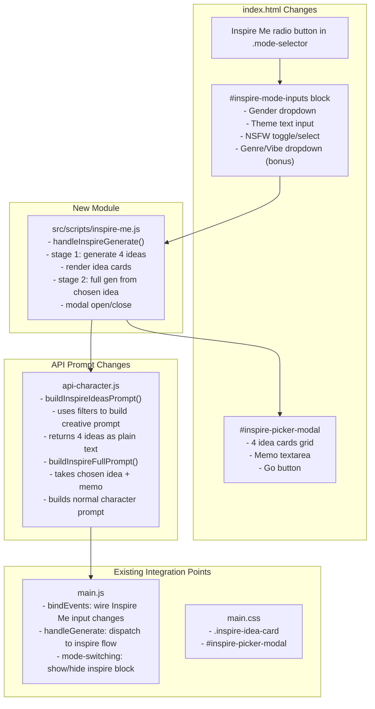
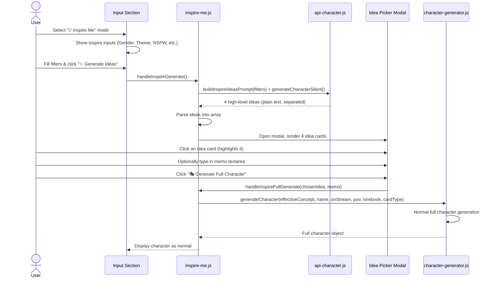

# Inspire Me Mode — Implementation Plan

## Overview

Add a 2-stage "Inspire Me" generation mode as a third radio option alongside Classic Mode and Web Search Mode.

**Stage 1 (Idea Spark):** User picks filters → 4 high-level character ideas (a couple sentences each) are generated → user picks one and optionally adds a memo.

**Stage 2 (Full Generation):** The chosen idea + memo are fed into the normal character-generation pipeline → full character card with all fields.

---

## Architecture Diagram



---

## User Flow



---

## Detailed File-by-File Changes

### 1. `index.html` — Mode Selector + Inputs + Modal

#### A. Add third radio option (after line ~130)

Insert a third `<label>` in the `.mode-selector` div:

```html
<label class="mode-option" id="mode-inspire-label">
    <input type="radio" name="generation-mode" value="inspire" />
    <span>💡 Inspire Me</span>
</label>
```

#### B. Add Inspire Me input block (after `#search-mode-inputs`, before `#character-name`)

```html
<div id="inspire-mode-inputs" class="mode-input-block" style="display: none;">
    <div class="form-row" style="display: flex; gap: 1rem; margin-bottom: 1rem;">
        <div class="form-group" style="flex: 1;">
            <label for="inspire-gender" class="label">Gender</label>
            <select id="inspire-gender" class="input">
                <option value="any" selected>Any</option>
                <option value="male">Male</option>
                <option value="female">Female</option>
                <option value="genderless">Gender-less / Non-binary</option>
            </select>
        </div>
        <div class="form-group" style="flex: 1;">
            <label for="inspire-nsfw" class="label">Content Rating</label>
            <select id="inspire-nsfw" class="input">
                <option value="sfw" selected>SFW Only</option>
                <option value="nsfw">NSFW Allowed</option>
                <option value="any">No Preference</option>
            </select>
        </div>
    </div>
    <div class="form-group">
        <label for="inspire-theme" class="label">Theme / Direction</label>
        <input type="text" id="inspire-theme" class="input"
            placeholder="e.g. cyberpunk detective, fantasy tavern owner, post-apocalyptic survivor..." />
    </div>
    <div class="form-row" style="display: flex; gap: 1rem; margin-bottom: 1rem;">
        <div class="form-group" style="flex: 1;">
            <label for="inspire-genre" class="label">Genre / Vibe</label>
            <select id="inspire-genre" class="input">
                <option value="any" selected>Any / Surprise Me</option>
                <option value="fantasy">Fantasy</option>
                <option value="scifi">Sci-Fi</option>
                <option value="modern">Modern / Slice of Life</option>
                <option value="horror">Horror / Dark</option>
                <option value="romance">Romance</option>
                <option value="mystery">Mystery / Noir</option>
                <option value="historical">Historical</option>
                <option value="superhero">Superhero / Powered</option>
                <option value="apocalyptic">Post-Apocalyptic</option>
            </select>
        </div>
        <div class="form-group" style="flex: 1;">
            <label for="inspire-trope" class="label">Trope / Archetype (optional)</label>
            <input type="text" id="inspire-trope" class="input"
                placeholder="e.g. reluctant hero, villain redemption, enemies-to-lovers..." />
        </div>
    </div>
</div>
```

#### C. Add Inspire Me Idea Picker Modal (before closing `</body>`, after batch modal)

```html
<!-- Inspire Me Idea Picker Modal -->
<div id="inspire-picker-modal" class="modal-overlay" aria-hidden="true">
    <div class="api-settings-modal" style="max-width: min(95vw, 1000px); width: 92%; max-height: 92vh;">
        <div class="modal-header">
            <h2 class="modal-title">💡 Pick Your Concept</h2>
            <button id="inspire-picker-close-btn" class="modal-close">&times;</button>
        </div>
        <div class="modal-body">
            <p style="font-size: 0.875rem; color: var(--text-secondary); margin: 0 0 1rem;">
                Here are 4 character ideas based on your filters. Click one to select it, add any extra guidance below, then hit Go.
            </p>
            <div id="inspire-loading" style="text-align: center; padding: 2rem;">
                <div class="loading-spinner" style="margin: 0 auto;"></div>
                <p style="margin-top: 1rem;">Brainstorming ideas...</p>
            </div>
            <div id="inspire-ideas-grid" class="inspire-ideas-grid" style="display: none;"></div>
            <div id="inspire-memo-area" style="display: none; margin-top: 1.25rem;">
                <label for="inspire-memo" class="label">Extra Guidance (optional)</label>
                <textarea id="inspire-memo" class="textarea" rows="3"
                    placeholder="Any tweaks or details you want in the full character... e.g. make them older, give them a dark secret, set it in space..."></textarea>
            </div>
            <div id="inspire-confirm-area" style="display: none; margin-top: 1.25rem; text-align: right;">
                <button id="inspire-go-btn" class="btn-primary" style="font-size: 1.1rem; padding: 0.75rem 2.5rem;">
                    🎭 Generate Full Character
                </button>
            </div>
        </div>
    </div>
</div>
```

---

### 2. `main.css` — Styles

Add new CSS blocks (appended at end, before the dark-theme sections):

```css
/* ── Inspire Me Mode ──────────────────────────────────────────────────────────── */

.inspire-ideas-grid {
    display: grid;
    grid-template-columns: repeat(2, 1fr);
    gap: 1rem;
}

@media (max-width: 640px) {
    .inspire-ideas-grid {
        grid-template-columns: 1fr;
    }
}

.inspire-idea-card {
    background: var(--surface-muted);
    border: 2px solid var(--border);
    border-radius: 0.6rem;
    padding: 1rem;
    cursor: pointer;
    transition: border-color 0.2s, background 0.2s, transform 0.15s;
    display: flex;
    flex-direction: column;
    gap: 0.5rem;
}

.inspire-idea-card:hover {
    border-color: var(--accent-soft);
    background: var(--surface);
}

.inspire-idea-card.selected {
    border-color: var(--accent);
    background: var(--accent-weak, rgba(0, 102, 204, 0.08));
    transform: scale(1.01);
}

.inspire-idea-card .idea-num {
    font-size: 0.75rem;
    font-weight: 700;
    color: var(--accent);
    text-transform: uppercase;
    letter-spacing: 0.05em;
}

.inspire-idea-card .idea-name {
    font-size: 1.05rem;
    font-weight: 600;
    color: var(--text-primary);
}

.inspire-idea-card .idea-desc {
    font-size: 0.85rem;
    color: var(--text-secondary);
    line-height: 1.5;
    flex: 1;
}
```

---

### 3. `src/scripts/inspire-me.js` — New Module

This is the core of the feature. It extends `CharacterGeneratorApp.prototype` (same pattern as `batch-generator.js`).

```js
// Inspire Me Module — extends CharacterGeneratorApp prototype
// 2-stage generation: (1) 4 idea sparks from filters, (2) full character from chosen idea
Object.assign(CharacterGeneratorApp.prototype, {

    /* ── State ──────────────────────────────────────────────────────────────── */
    _inspireIdeas: [],       // Array of { name, description } idea objects
    _inspireSelectedIdx: -1,
    _inspireIsGenerating: false,

    /* ── Stage 1: Generate 4 Ideas ──────────────────────────────────────────── */

    async handleInspireGenerate() {
        // Validation
        this.saveAPISettings();
        const errors = this.config.validateConfig();
        if (errors.length > 0) {
            this.showNotification(`Configuration errors: ${errors.join(", ")}`, "error");
            return;
        }

        const filters = {
            gender: document.getElementById("inspire-gender")?.value || "any",
            theme: document.getElementById("inspire-theme")?.value?.trim() || "",
            nsfw: document.getElementById("inspire-nsfw")?.value || "sfw",
            genre: document.getElementById("inspire-genre")?.value || "any",
            trope: document.getElementById("inspire-trope")?.value?.trim() || "",
        };

        if (!filters.theme) {
            this.showNotification("Please enter a theme or direction", "warning");
            return;
        }

        this._inspireIsGenerating = true;
        this._inspireIdeas = [];
        this._inspireSelectedIdx = -1;

        // Open modal with loading state
        this._openInspireModal();
        document.getElementById("inspire-loading").style.display = "block";
        document.getElementById("inspire-ideas-grid").style.display = "none";
        document.getElementById("inspire-memo-area").style.display = "none";
        document.getElementById("inspire-confirm-area").style.display = "none";

        try {
            // Call API to generate 4 ideas (non-streaming, fast)
            const rawIdeas = await window.apiHandler.generateInspireIdeas(filters);
            this._inspireIdeas = this._parseInspireIdeas(rawIdeas);

            // Render the idea cards
            this._renderInspireIdeas();
            document.getElementById("inspire-loading").style.display = "none";
            document.getElementById("inspire-ideas-grid").style.display = "grid";
            document.getElementById("inspire-memo-area").style.display = "block";
            document.getElementById("inspire-confirm-area").style.display = "block";
        } catch (error) {
            console.error("Inspire Me idea generation failed:", error);
            this.showNotification(`Failed to generate ideas: ${error.message}`, "error");
            this.closeInspireModal();
        } finally {
            this._inspireIsGenerating = false;
        }
    },

    _parseInspireIdeas(rawText) {
        // Parse the AI response into 4 idea objects
        // Expect format: "1. **Name** — Description..." or similar
        const ideas = [];
        const blocks = rawText.split(/\n\s*\n(?=\d+\.\s)/); // split on blank line before numbered items
        
        // Fallback: split by numbered lines
        const lines = rawText.split('\n');
        let currentIdea = null;
        for (const line of lines) {
            const match = line.match(/^(\d+)[\.\)]\s*(?:\*\*)?(.+?)(?:\*\*)?\s*(?:—|–|-)\s*(.+)/);
            if (match) {
                if (currentIdea) ideas.push(currentIdea);
                currentIdea = {
                    name: match[2].trim(),
                    description: match[3].trim()
                };
            } else if (currentIdea) {
                currentIdea.description += ' ' + line.trim();
            }
        }
        if (currentIdea) ideas.push(currentIdea);

        // Ensure we have exactly 4
        while (ideas.length < 4) {
            ideas.push({ name: `Idea ${ideas.length + 1}`, description: "A unique character concept..." });
        }
        return ideas.slice(0, 4);
    },

    _renderInspireIdeas() {
        const grid = document.getElementById("inspire-ideas-grid");
        if (!grid) return;
        grid.innerHTML = "";

        this._inspireIdeas.forEach((idea, idx) => {
            const card = document.createElement("div");
            card.className = "inspire-idea-card";
            card.dataset.ideaIdx = idx;
            card.innerHTML = `
                <span class="idea-num">Idea #${idx + 1}</span>
                <span class="idea-name">${escapeHtml(idea.name)}</span>
                <span class="idea-desc">${escapeHtml(idea.description)}</span>
            `;
            card.addEventListener("click", () => this._selectInspireIdea(idx));
            grid.appendChild(card);
        });
    },

    _selectInspireIdea(idx) {
        this._inspireSelectedIdx = idx;
        // Update visual selection
        document.querySelectorAll(".inspire-idea-card").forEach((card, i) => {
            card.classList.toggle("selected", i === idx);
        });
    },

    /* ── Stage 2: Full Character from Chosen Idea ────────────────────────────── */

    async handleInspireFullGenerate() {
        if (this._inspireSelectedIdx < 0) {
            this.showNotification("Please pick one of the ideas first", "warning");
            return;
        }

        // Close modal first
        this.closeInspireModal();

        const chosenIdea = this._inspireIdeas[this._inspireSelectedIdx];
        const memo = document.getElementById("inspire-memo")?.value?.trim() || "";

        // Set up for normal character generation using the chosen idea as concept
        const effectiveConcept = `${chosenIdea.name}: ${chosenIdea.description}${memo ? `\n\nAdditional guidance: ${memo}` : ""}`;
        const characterName = document.getElementById("character-name").value.trim();
        const pov = document.getElementById("pov-select").value;
        const cardType = document.getElementById("card-type-select")?.value || "single";

        // This follows the same pattern as handleGenerate() but uses effectiveConcept
        this.isGenerating = true;
        this.setGeneratingState(true);

        this.stSourceAvatar = null;
        this._updatePushButton();

        this.hideResultSection();
        this.currentImageUrl = null;
        if (window.apiHandler) window.apiHandler.lastGeneratedImagePrompt = null;

        // Clear image prompt
        const customPromptTextarea = document.getElementById("custom-image-prompt");
        if (customPromptTextarea) { customPromptTextarea.value = ""; window.updatePromptCharCount?.(); }

        ["description-prompt", "personality-prompt", "scenario-prompt", "first-message-prompt", "example-messages-prompt"]
            .forEach((id) => { const el = document.getElementById(id); if (el) el.value = ""; });

        const imageContent = document.getElementById("image-content");
        if (imageContent) {
            imageContent.innerHTML = `<div class="image-placeholder"><div class="loading-spinner"></div></div>`;
        }

        this.lorebookEntries = [];
        this.updateLorebookEntryCount();
        this.altGreetings = [];
        this.updateAltGreetingsCount();
        this.clearStream();

        try {
            // Save prompt to library
            const promptSaved = await this.savePromptToLibrary({
                concept: `${chosenIdea.name}: ${chosenIdea.description}`,
                characterName, pov, cardType,
                lorebookData: this.lorebookData,
                inspireMemo: memo,
            });
            await this.refreshLibraryViews();
            if (!promptSaved) this.showStreamMessage("Warning: Prompt could not be saved to local library.\n");

            this.showStreamMessage("Starting character generation from your chosen idea...\n\n");
            this.currentCharacter = await this.characterGenerator.generateCharacter(
                effectiveConcept, characterName,
                (token, fullContent) => this.handleCharacterStream(token, fullContent),
                pov, this.lorebookData, cardType,
            );

            // Stamp cardType
            this.currentCharacter.cardType = cardType;
            if (cardType === "group" || cardType === "scenario") {
                if (!Array.isArray(this.currentCharacter.tags)) this.currentCharacter.tags = [];
                if (!this.currentCharacter.tags.includes(cardType)) this.currentCharacter.tags.push(cardType);
            }

            this.showStreamMessage("\n\nGenerating example messages...\n");
            await this.handleGenerateExampleMessages(true);

            this.showStreamMessage("Generating creator notes...\n");
            try {
                const notes = await this.apiHandler.generateCreatorNotes(this.currentCharacter);
                if (notes) { this.currentCharacter.creatorNotes = notes; }
            } catch (notesError) {
                console.warn("Creator notes generation failed (non-fatal):", notesError);
            }

            this.originalCharacter = JSON.parse(JSON.stringify(this.currentCharacter));
            await this.saveCardToLibrary();
            await this.refreshLibraryViews();

            this.showStreamMessage("\nCharacter generation complete!\n");
            this.displayCharacter();

            // Auto-generate image if configured (same as handleGenerate)
            const imageApiBase = this.config.get("api.image.baseUrl");
            const imageApiKey = this.config.get("api.image.apiKey");
            const enableImageGeneration = this.config.get("app.enableImageGeneration");
            if (imageApiBase && imageApiKey && enableImageGeneration) {
                try {
                    await this.handleGenerateImage();
                } catch (imgError) {
                    console.warn("Auto image generation failed:", imgError);
                }
            }
        } catch (error) {
            console.error("Inspire Me full generation failed:", error);
            this.showStreamMessage(`\nGeneration failed: ${error.message}\n`);
            this.showNotification(`Generation failed: ${error.message}`, "error");
        } finally {
            this.isGenerating = false;
            this.setGeneratingState(false);
        }
    },

    /* ── Modal Management ──────────────────────────────────────────────────── */

    _openInspireModal() {
        const modal = document.getElementById("inspire-picker-modal");
        if (!modal) return;
        modal.classList.add("show");
        document.body.style.overflow = "hidden";
    },

    closeInspireModal() {
        const modal = document.getElementById("inspire-picker-modal");
        if (!modal) return;
        modal.classList.remove("show");
        document.body.style.overflow = "";
    },
});
```

---

### 4. `src/scripts/api-character.js` — Prompt Builder

Add two new methods to `APIHandler.prototype`:

```js
// Generate 4 high-level character ideas based on filters
async generateInspireIdeas(filters) {
    const prompt = this.buildInspireIdeasPrompt(filters);
    const model = this.config.get("api.text.model") || "glm-4-6";

    const data = {
        model: model,
        messages: [
            { role: "system", content: prompt.systemPrompt },
            { role: "user", content: prompt.userPrompt },
        ],
        temperature: 0.9,      // Higher creativity for brainstorming
        max_tokens: 2048,       // Short responses — just 4 ideas
        stream: false,
    };

    const response = await this.makeRequest("/chat/completions", data, false, false);
    return this.processNormalResponse(response);
},

buildInspireIdeasPrompt(filters) {
    const genderMap = {
        any: "any gender identity",
        male: "male",
        female: "female",
        genderless: "genderless or non-binary",
    };
    const nsfwMap = {
        sfw: "The ideas MUST be strictly SFW / safe for work.",
        nsfw: "NSFW themes are allowed if the concept calls for it.",
        any: "No content restrictions.",
    };

    const systemPrompt = [
        "You are a creative character-concept brainstormer. Your job is to generate 4 unique, compelling character ideas based on user-specified filters.",
        "",
        "Each idea must be a STRICTLY FORMATTED single line like this:",
        "N. **Character Name/Title** — Two to three sentences describing the character's core concept, their defining trait or conflict, and the kind of story they belong in.",
        "",
        "RULES:",
        "- Generate exactly 4 ideas, numbered 1 through 4.",
        `- Gender filter: ${genderMap[filters.gender] || "any"}.`,
        `- ${nsfwMap[filters.nsfw] || "No content restrictions."}`,
        filters.genre !== "any" ? `- Genre: ${filters.genre}.` : "",
        filters.trope ? `- Consider the trope/archetype: ${filters.trope}.` : "",
        "- Be wildly creative and diverse — each idea should feel distinct from the others.",
        "- Avoid cliches unless using them in an intentionally fresh way.",
        "- Each description must be exactly 2-3 sentences. No bullet points, no markdown beyond the bolded name.",
    ].filter(Boolean).join("\n");

    const userPrompt = filters.theme
        ? `Theme / direction: ${filters.theme}\n\nGenerate 4 character ideas based on the above theme.`
        : "Generate 4 original character ideas. Surprise me!";

    return { systemPrompt, userPrompt };
},
```

---

### 5. `main.js` — Integration

#### A. Mode-switching (in `bindEvents()`, lines ~72-83)

Update the mode-change handler to include `inspire`:

```js
const modeRadios = document.querySelectorAll('input[name="generation-mode"]');
if (modeRadios.length > 0) {
    const classicBlock = document.getElementById("classic-mode-inputs");
    const searchBlock = document.getElementById("search-mode-inputs");
    const inspireBlock = document.getElementById("inspire-mode-inputs");       // NEW
    const onModeChange = () => {
        const mode = document.querySelector('input[name="generation-mode"]:checked')?.value || "classic";
        if (classicBlock) classicBlock.style.display = mode === "classic" ? "" : "none";
        if (searchBlock) searchBlock.style.display = mode === "search" ? "" : "none";
        if (inspireBlock) inspireBlock.style.display = mode === "inspire" ? "" : "none";  // NEW
    };
    modeRadios.forEach((r) => r.addEventListener("change", onModeChange));
    onModeChange();
}
```

#### B. Generate button handler (around line 68)

Wire a dedicated button for the Inspire Me "Go" (the main generate-btn should trigger the idea generation stage for inspire mode):

```js
// The existing line: document.getElementById("generate-btn").addEventListener("click", () => this.handleGenerate());
// handleGenerate() already reads generationMode — add a dispatch for "inspire"
```

Update `handleGenerate()` (around line 769):

```js
async handleGenerate() {
    if (this.isGenerating) return;
    
    this.saveAPISettings();
    const errors = this.config.validateConfig();
    if (errors.length > 0) {
        this.showNotification(`Configuration errors: ${errors.join(", ")}`, "error");
        return;
    }

    const generationMode = document.querySelector('input[name="generation-mode"]:checked')?.value || "classic";

    // ── NEW: Dispatch to Inspire Me flow ──
    if (generationMode === "inspire") {
        return this.handleInspireGenerate();
    }

    // ... rest of existing handleGenerate() unchanged ...
```

#### C. Modal event binding

Add to `bindEvents()`:

```js
// Inspire Me modal events
const inspirePickerCloseBtn = document.getElementById("inspire-picker-close-btn");
const inspirePickerModal = document.getElementById("inspire-picker-modal");
const inspireGoBtn = document.getElementById("inspire-go-btn");
if (inspirePickerCloseBtn) inspirePickerCloseBtn.addEventListener("click", () => this.closeInspireModal());
if (inspirePickerModal) inspirePickerModal.addEventListener("click", (e) => { if (e.target === inspirePickerModal) this.closeInspireModal(); });
if (inspireGoBtn) inspireGoBtn.addEventListener("click", () => this.handleInspireFullGenerate());
```

#### D. Script loading

Add to `index.html` in the script loading section (alongside other module scripts):

```html
<script src="src/scripts/inspire-me.js?v=20260601"></script>
```

---

### 6. `main.css` — Modal Overlay Show Class

Ensure the `.modal-overlay.show` rule exists (it likely already does from the batch modal). If not, add:

```css
.modal-overlay.show {
    display: flex !important;
}
```

---

## Key Design Decisions

| Decision | Rationale |
|----------|-----------|
| **2-stage flow with modal** | Separates ideation from generation; user can pick before committing expensive API call |
| **4 ideas (not open-ended)** | Consistent with batch-generate pattern; enough variety without overwhelming |
| **Non-streaming for ideas** | Ideas are short — streaming would flicker; fast response preferred |
| **Streaming for full generation** | Same as existing `handleGenerate()` — users expect to see progress |
| **New module file** | Follows existing architecture pattern (`batch-generator.js`, `image-gallery.js`, etc.) |
| **Extend prototype** | Same pattern as all other feature modules; keeps `main.js` manageable |
| **Memo field** | Gives user fine-grained control after picking an idea without restarting |
| **Genre + Trope as bonus fields** | Adds meaningful creative direction beyond just gender/theme/NSFW |

---

## Edge Cases to Handle

1. **User clicks Generate Ideas with empty theme** → validation blocks, shows warning (theme is the only required filter)
2. **User clicks Go without selecting an idea** → validation blocks, shows warning
3. **API fails during idea generation** → error notification, modal closes
4. **API fails during full generation** → same error handling as existing `handleGenerate()`
5. **User closes modal without picking** → no state lost, can re-generate ideas
6. **User switches mode mid-flow** → no issue; Inspire Me modal is independent
7. **ST/Abort during full generation** → same `handleStop()` works via existing `currentAbortController`
8. **Save to library** → prompt saved with `inspireMemo` field; cards saved as normal
9. **Dark mode** → new CSS uses existing CSS variables, automatically compatible
10. **Mobile responsive** → idea grid collapses to single column at 640px

---

## Files Summary

| File | Action | Est. Lines |
|------|--------|------------|
| `index.html` | Add radio, inputs block, modal HTML | ~90 lines |
| `src/styles/main.css` | Add `.inspire-*` styles | ~60 lines |
| `src/scripts/inspire-me.js` | **New file** — full module | ~220 lines |
| `src/scripts/api-character.js` | Add `generateInspireIdeas` + `buildInspireIdeasPrompt` | ~55 lines |
| `src/scripts/main.js` | Wire mode switch + generate dispatch + modal events | ~15 lines changed |
