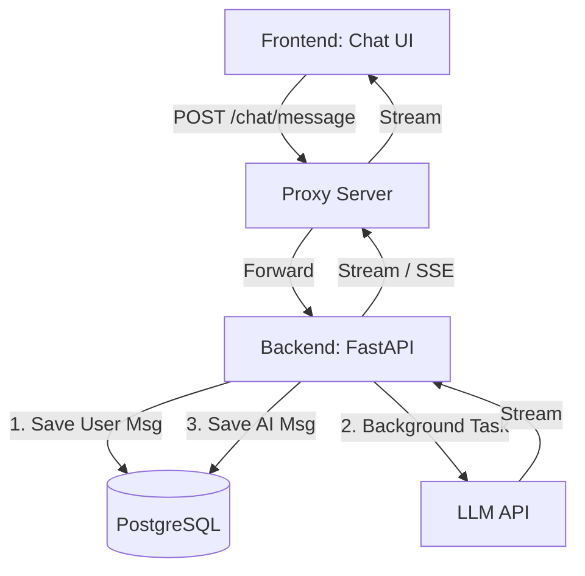

# Roleplay Chat Feature Implementation Plan

## Overview
A new top-level tab ("Roleplay Chat") that provides a SillyTavern-like chatting experience. 
It will support 1-on-1 and group chats, robust system prompt management, automatic evolving memory, and highly resilient server-side processing to ensure mobile/iOS compatibility.

---

## 1. Architecture & Container Strategy

**Decision point on containers:** 
While we *could* create a brand new `chat-engine` Docker container, it is highly recommended to build this into the existing `storywriterbackend` container (perhaps renaming it conceptually to `core-backend` later). 
*Why?* The `storywriterbackend` already holds the PostgreSQL database connection, the `CharacterCard` models, and the LLM API integration layer. Duplicating this into a new container adds unnecessary overhead. We can simply add a new `chat_manager.py` service and `/routers/chat.py` endpoints to the existing backend.

### Flow Diagram

---

## 2. Key Features & Solutions

### A. Highly Resilient iOS Compatibility (Lock-Screen Safe)
**The Problem:** iOS heavily restricts background execution. If a user sends a message and immediately locks their phone, the browser socket dies. Standard API setups will cancel the LLM request mid-generation, losing the response.
**The Solution (Decoupled Generation):**
1. When the user sends a message, the backend saves it to the DB instantly.
2. The backend launches the LLM generation as a **Background Async Task** (detached from the HTTP request lifecycle).
3. The frontend connects to a Server-Sent Events (SSE) stream to listen to the generation.
4. **If the user locks the phone and the SSE disconnects**, the background task *continues running* on the server, finishes generating, and saves the AI's message to the DB.
5. When the user unlocks their phone, the UI fetches the latest chat history and seamlessly displays the generated message.

### B. Maximizing LLM Cache Utilization (Prefix Caching)
API providers (like nano-gpt.com with GLM 5.1 or DeepSeekv4Pro), as well as Anthropic and OpenAI, increasingly utilize prefix caching which drastically reduces costs and latency for long chats. Cache is broken the moment *any* text changes in the prompt.
**The Solution (Strict Prompt Ordering):**
We must structure the prompt payload from most-static to most-dynamic:
1. **System Prompts (Static):** Main instructions, jailbreaks, format rules.
2. **Character Cards (Static):** Name, description, personality, scenario.
3. **Lorebook (Semi-Static):** World info.
4. **Dynamic Memory / Summaries (Changes periodically):** The evolving story details.
5. **Chat History (Appends constantly):** Sliding window of the last N messages.

*By keeping sections 1, 2, and 3 completely identical across turns, the LLM caches 80% of the prompt context automatically.*

### C. Evolving Memory & World Data
To ensure the story remains consistent without blowing up the context window:
1. **Rolling History Summary:** Similar to the Story Writer, once the chat hits X messages, the oldest messages are summarized and pushed into a "Summary" block.
2. **Auto-Fact Extraction (The "Memory Book"):** Every ~10 messages, a lightweight background LLM task parses recent history to extract *permanent facts* (e.g., "User gave Character a silver ring", "They are currently in the tavern"). These facts are added to an active "Memory" block injected right before the chat history.

### D. Group Chats (Multi-Character)
* **Selection:** Users can create a chat and link multiple Character Cards to it.
* **Routing:** When the user sends a message, the UI can either specify *who* they are talking to (via a dropdown/button), OR we can use an LLM router (a fast, cheap model) to decide which character is most likely to respond based on the context.

### E. Embedded Graphical Elements (Rich UI)
**The Requirement:** Support visually distinct elements inside chats, like simulated phone text messages, health bars, or task progress indicators, updating dynamically as the story progresses.
**The Solution:**
1. **System Prompting:** Tailor the system prompt (optimized for GLM 5.1 / DeepSeekv4Pro) to instruct the model to use specific markdown/XML tags when these events occur (e.g., `<text-message sender="Alice">Hi!</text-message>` or `<stat-bar name="Health" value="80" max="100" />`).
2. **Custom Frontend Parser:** Intercept these specific tags in the chat UI before rendering standard Markdown. Convert them into rich CSS/HTML components (e.g., an iOS-style chat bubble or an animated progress bar).
3. **State Tracking:** To ensure the LLM remembers current stats (like health being at 80/100) and keeps them updated accurately over time, the active values can be continuously injected into the dynamic memory block alongside the rolling summary.

### F. Out of Character (OOC) Instructions
**The Requirement:** A way to silently guide the AI's next response without permanently breaking the immersion of the chat flow.
**The Solution:**
Add a collapsible input field next to the main chat box labeled "OOC Instruction". When text is entered here, the backend appends it to the very end of the user's message block in a strict system format (e.g., `[OOC Note to AI: <instruction>]`). This text is saved in the database under `ooc_note` for that specific message but is visually hidden (or styled subtly) in the normal chat timeline.

---

## 3. Database Schema (PostgreSQL)

New tables to be added to `storywriterbackend/app/models.py`:

**`RoleplayChat`**
- `id`: UUID
- `user_id`: String
- `title`: String
- `created_at` / `updated_at`
- `system_prompt`: Text (Customizable per chat)
- `summary`: Text (Rolling summary)

**`ChatCharacterLink`** (Many-to-Many)
- `chat_id`: UUID
- `card_id`: UUID

**`ChatMessage`**
- `id`: UUID
- `chat_id`: UUID
- `role`: String (user, assistant, system)
- `character_name`: String (Allows distinguishing which AI character spoke in a group chat)
- `content`: Text
- `ooc_note`: Text (Hidden instruction sent alongside the message)
- `created_at`: Timestamp

**`ChatMemory`**
- `id`: UUID
- `chat_id`: UUID
- `fact`: Text (Extracted evolving story details)
- `is_active`: Boolean

---

## 4. Phased Implementation Plan

### Phase 1: Core Chat & State (The Foundation)
- [ ] **Backend:** Add DB models (`RoleplayChat`, `ChatMessage`).
- [ ] **Backend:** Add CRUD endpoints for chats (Create chat, list chats, delete chat).
- [ ] **Backend:** Add simple generation endpoint (`POST /chat/{id}/message`) with background task resilience and SSE streaming.
- [ ] **Frontend:** Add "Roleplay Chat" tab to UI.
- [ ] **Frontend:** Build chat sidebar (list sessions) and main chat window (message bubbles, input area).

### Phase 2: System Prompts, Caching & Rich Elements
- [x] **Frontend/Backend:** Add a "Chat Settings" drawer to edit System Prompts and Generation Settings (Temp, Model - e.g., GLM 5.1, DeepSeekv4Pro via nano-gpt.com).
- [x] **Backend:** Implement the strict Prompt Builder order (System -> Card -> Lorebook -> History) to guarantee Prefix Caching hits.
- [x] **Frontend:** Build a custom Markdown/UI parser for chat bubbles to render embedded graphical elements (simulated phone text messages, health bars, task progress).
- [x] **Backend:** Create default system prompt templates that explicitly encourage the LLM to output these custom UI tags.

### Phase 3: Group Chats
- [x] **Frontend:** Update "New Chat" modal to allow selecting multiple characters.
- [x] **Backend:** Update Context Builder to inject multiple character cards. 
- [x] **Frontend:** Add UI controls to manually trigger a specific character to reply, or let them reply automatically.

### Phase 4: Evolving Memory
- [x] **Backend:** Implement the `Rolling Summary` threshold.
- [x] **Backend:** Create the background task for `Auto-Fact Extraction` to populate the `ChatMemory` table asynchronously.

---

## 5. Potential Issues & Risks to Consider

1. **Context Limits vs Group Chats:** Injecting 3-4 highly detailed V2 Character Cards into the prompt consumes a lot of tokens. Even with prefix caching, if the total prompt exceeds the model's context window (e.g., older open-source models at 8k), it will fail. *Mitigation:* Add token tracking to the UI, and allow users to select lighter/summary versions of cards if needed.
2. **Group Chat Identity Confusion:** LLMs sometimes get confused and speak for other characters or the user in group chats. *Mitigation:* Strict system prompt formatting with XML tags (e.g., `<character_name>`) and utilizing the LLM's `stop` sequences to prevent it from roleplaying the user.
3. **Background Task Overhead:** If many users are chatting concurrently and background memory-extraction triggers frequently, it could bottleneck the proxy/backend. *Mitigation:* Ensure extraction uses a fast/cheap model or is debounced efficiently.
