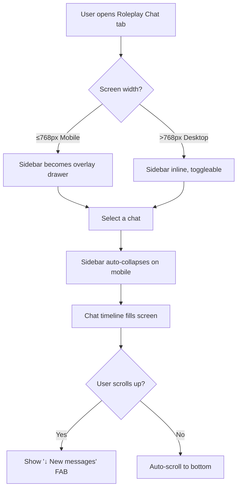

# Roleplay Chat — UI/UX Improvement Plan (Mobile-First)

## Summary of Current Issues

After reviewing [`chat-handler.js`](src/scripts/chat-handler.js), [`main.css`](src/styles/main.css:2380), and [`index.html`](index.html:1583), the following problems exist:

### Critical Mobile Issues
1. **Sidebar takes 25-30vh on mobile** — When the sidebar is shown, the chat timeline gets squeezed to ~70% of the screen. The auto-collapse on chat selection helps, but re-opening the sidebar covers a third of the viewport.
2. **64px avatars waste horizontal space** — On a ~375px wide phone, each message loses 74px to avatars, leaving only ~300px for text. Combined with 85% max-width on the bubble wrapper, actual text width is only ~250px.
3. **Chat input row is cramped** — The input row packs OOC toggle, speaker select, textarea, and Send button into a single flex row with no wrapping strategy for small screens.
4. **No bottom-safe-area padding** — iPhones with home indicator bars have the input area hidden behind the system gesture bar.
5. **CSS duplication** — Inline styles in `chat-handler.js` override or duplicate many rules from `main.css`, making it hard to reason about the final layout.
6. **No swipe-to-reply or gesture shortcuts** — Touch targets are small and undiscoverable on mobile.
7. **Message actions always visible on mobile** — They clutter the already-compact bubble name area.

### Desktop Issues
1. **Chat height calculation is fragile** — `adjustChatLayout()` tries to compute available height from `getBoundingClientRect()` minus footer, but this breaks when the footer height changes or the viewport is resized.
2. **Fullscreen toggle button hidden on desktop** — Forcing mobile-only fullscreen is an arbitrary restriction.
3. **No keyboard shortcut for sending** — Only Enter works; Escape to cancel / blur is missing.
4. **Timeline doesn't auto-scroll when the user scrolls up** — New messages always force-scroll to bottom, disrupting reading history during streaming.

---

## Proposed Improvements

### Phase 1: Mobile Layout Overhaul (Highest Priority)

#### 1.1 Replace sidebar with a slide-out drawer on mobile
**Current:** Sidebar above chat in a column layout, consuming 25vh.
**Proposed:** On screens ≤768px, the sidebar becomes an overlay drawer that slides in from the left with a backdrop. Triggered by a hamburger/arrow button in the header.

```
┌─────────────────────┐
│ ☰  Chat Title    ⛶ │  ← Header (fixed height, ~48px)
├─────────────────────┤
│                     │
│   Chat Timeline     │  ← flex: 1, scrollable
│   (messages)        │
│                     │
├─────────────────────┤
│ 🎭 [OOC input…]     │  ← Collapsible OOC row
│ [speaker│input…│▶]  │  ← Input row (wraps on mobile)
└─────────────────────┘
```

**Changes needed:**
- Move `#chat-sidebar-container` to `position: fixed; z-index: 100;` with a semi-transparent backdrop on mobile
- Add CSS transition for slide-in/out
- Keep existing toggle button but change behavior: on mobile it toggles drawer; on desktop it toggles sidebar visibility in-place
- Update [`fixMobileLayout()`](src/scripts/chat-handler.js:158) styles

#### 1.2 Reduce avatar size on mobile
**Current:** 64×64px avatars on all screen sizes.
**Proposed:** 36×36px on ≤768px, 48×48px on ≤1024px, 64×64px on larger.

**Changes needed:**
- Add a CSS custom property or media query for `.chat-bubble-wrapper` avatar size
- Update the inline style in [`appendMessage()`](src/scripts/chat-handler.js:1009) to use a CSS class instead of inline width/height

#### 1.3 Make the input area stack vertically on narrow screens
**Current:** All input controls in a single row `flex-direction: row`.
**Proposed:** On ≤500px, wrap the input area:
```
[OOC toggle] [speaker select]       ← row 1
[textarea ………………………] [Send]       ← row 2
```

**Changes needed:**
- Add `flex-wrap: wrap` to `.chat-input-controls` on mobile
- Give the textarea `flex-basis: 100%` on narrow screens
- Reduce Send button to just an icon (▶ or ↑) on mobile to save width

#### 1.4 Add safe-area padding for notched phones
**Current:** No `env(safe-area-inset-bottom)` usage.
**Proposed:** Add padding-bottom to `.chat-input-area` using `env(safe-area-inset-bottom, 0.5rem)`.

**Changes needed:**
- Add to the mobile media query in `main.css`
- Add `<meta name="viewport" content="… viewport-fit=cover">` to `index.html` (if not present)

#### 1.5 Fix the bubble width constraint
**Current:** `max-width: 85%` on `.chat-bubble-wrapper` combined with 74px avatar gap means bubbles are narrow on mobile.
**Proposed:** On mobile, `max-width: 92%` and reduce the content column gap. Let bubbles use more screen.

**Changes needed:**
- Media query in `main.css` adjusting `.chat-bubble-wrapper` max-width
- Reduce `contentCol.style.maxWidth` calc in `appendMessage()` from `calc(100% - 74px)` to a smaller value when avatars are smaller

### Phase 2: Desktop Polish

#### 2.1 Fix height calculation with CSS instead of JS
**Current:** `adjustChatLayout()` computes height imperatively on resize.
**Proposed:** Use `height: 100%` / `flex: 1` with `overflow: hidden` on the container chain from `#app-root` down through `.container`, `.main`, and `#view-roleplaychat`. The JS height calculation should be a fallback only.

**Changes needed:**
- Audit the flex/grid chain from `.container` → `.main` → `#view-roleplaychat` → `.chat-container` → `.chat-main` → `#chat-timeline`
- Ensure each ancestor has a defined height or flex basis
- Remove or simplify `adjustChatLayout()`

#### 2.2 Show fullscreen toggle on all screen sizes
**Current:** `#chat-fullscreen-toggle` hidden on desktop via CSS.
**Proposed:** Always show it. It's useful for focused chatting on any device.

**Change needed:**
- Remove the `display: none !important` rule for desktop in [`fixMobileLayout()`](src/scripts/chat-handler.js:183)

#### 2.3 Smart auto-scroll (don't interrupt reading)
**Current:** `scrollToBottom()` fires on every new message chunk, yanking the user to the bottom.
**Proposed:** Only auto-scroll if the user is already near the bottom (within 150px of the bottom). If they've scrolled up to read history, show a "↓ New messages" floating button instead.

**Changes needed:**
- In [`scrollToBottom()`](src/scripts/chat-handler.js:1253), check `timeline.scrollTop + timeline.clientHeight >= timeline.scrollHeight - 150`
- Add a floating "scroll to bottom" button when scrolled up
- Reset to auto-scroll when the user manually scrolls to bottom

### Phase 3: UX Refinements

#### 3.1 Add a "Stop Generation" button
**Current:** No way to cancel an in-progress generation except waiting.
**Proposed:** Replace the Send button with a red Stop (⏹) button during generation, which calls an abort endpoint or aborts the fetch.

**Changes needed:**
- Store the `AbortController` reference in `sendMessage()`
- Toggle Send ↔ Stop button UI when `isGenerating` changes

#### 3.2 Improve OOC field discoverability
**Current:** Buried behind a toggle button labeled "🎭 OOC".
**Proposed:** When OOC has content, show a small indicator badge on the toggle button. Also consider a persistent collapsed input (like iMessage apps bar) instead of full hide/show.

#### 3.3 Add message timestamps
**Current:** No timestamps shown on individual messages.
**Proposed:** Show a subtle timestamp (e.g., "12:34") on hover or always on mobile, positioned below/next to the sender name.

#### 3.4 Group chat visual distinction
**Current:** All AI messages look identical regardless of which character spoke.
**Proposed:** Give each character a distinct accent color (derived from their name hash or card data). Use a thin colored left border on their bubbles.

---

## Implementation Order

| # | Task | File(s) | Effort |
|---|------|---------|--------|
| 1 | Mobile sidebar → slide-out drawer | `main.css`, `chat-handler.js` | Medium |
| 2 | Responsive avatar sizes | `main.css`, `chat-handler.js` | Small |
| 3 | Stack input area on narrow screens | `main.css` | Small |
| 4 | Safe-area bottom padding | `main.css`, `index.html` | Tiny |
| 5 | Relax bubble max-width on mobile | `main.css`, `chat-handler.js` | Small |
| 6 | Fix height using CSS flex chain | `main.css`, `chat-handler.js` | Medium |
| 7 | Fullscreen toggle on all screens | `chat-handler.js` | Tiny |
| 8 | Smart auto-scroll + "new messages" button | `chat-handler.js` | Medium |
| 9 | Stop Generation button | `chat-handler.js` | Small |
| 10 | OOC indicator badge | `chat-handler.js` | Tiny |
| 11 | Message timestamps | `chat-handler.js` | Small |
| 12 | Character accent colors in group chat | `chat-handler.js`, `main.css` | Small |

---

## Mermaid: Mobile Layout Flow



---

## Notes for Implementation

1. **Consolidate styles into `main.css`** where possible, rather than injecting via `<style>` blocks in JS. The `fixMobileLayout()` injected stylesheet should be minimized and moved to proper CSS.
2. **Use CSS custom properties** for responsive values (e.g., `--chat-avatar-size: 64px` with a media query override).
3. **Test on 375px (iPhone SE), 390px (iPhone 14), 414px (iPhone 11), and 768px (iPad mini)** viewport widths.
4. **Dark mode** already has overrides at the bottom of `main.css` — ensure new rules also have dark variants where colors are used.
