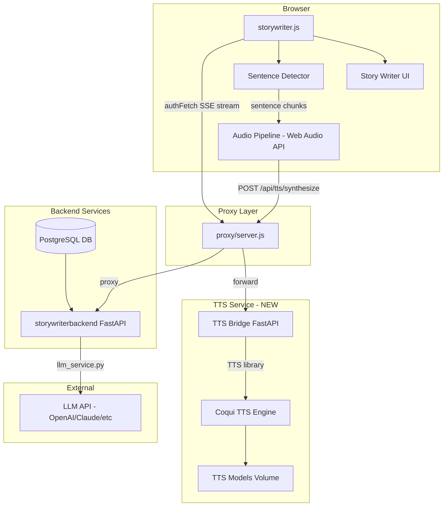
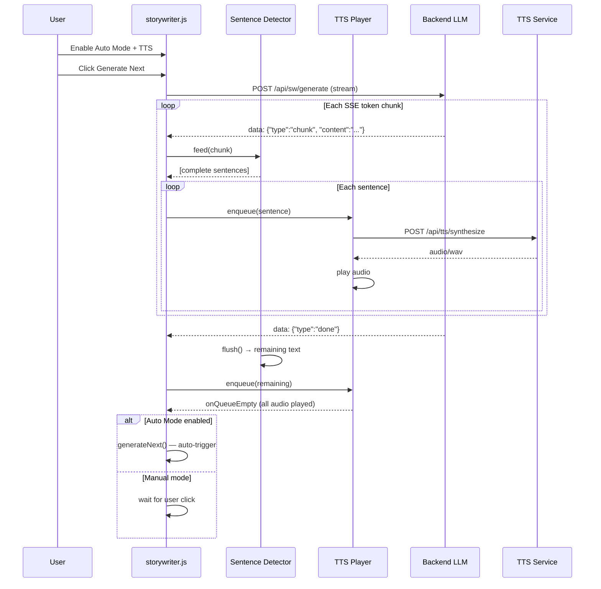

# Text-to-Speech Narration for Story Writer

## Overview

Add local text-to-speech narration to the Story Writer, powered by [Coqui TTS](https://github.com/coqui-ai/TTS) running as a Docker service. Users will be able to enable an **Auto Mode** that chains story generation with TTS narration, creating a hands-free listening experience. The system uses **sentence-level streaming TTS** to minimise gaps and keep audio flowing continuously.

---

## Architecture Diagram



---

## Component Breakdown

### 1. Coqui TTS Docker Service

**File:** `docker-compose.yml` (new service entry)

Add a new container running Coqui TTS via a thin Python FastAPI bridge:

```yaml
  tts:
    build:
      context: ./tts-service
      dockerfile: Dockerfile
    container_name: cardgen-tts
    restart: unless-stopped
    environment:
      - TTS_MODEL_NAME=${TTS_MODEL_NAME:-tts_models/en/vctk/vits}
    volumes:
      - ./tts-models:/root/.local/share/tts
    networks:
      - app-network
    # GPU support (optional)
    deploy:
      resources:
        reservations:
          devices:
            - driver: nvidia
              count: 1
              capabilities: [gpu]
```

**Notes:**
- Coqui TTS models are downloaded on first run and persisted in `./tts-models` volume.
- GPU acceleration is optional via NVIDIA Container Toolkit; falls back to CPU if unavailable.
- The service exposes a REST API on port 8500 internally.

### 2. TTS Bridge Service (Python FastAPI)

**New directory:** `tts-service/`

A lightweight FastAPI wrapper around the Coqui TTS Python library:

**Files:**
- `tts-service/Dockerfile` — Python 3.11-slim with Coqui TTS deps
- `tts-service/requirements.txt` — `fastapi`, `uvicorn`, `TTS`, `torch`, `numpy`, `soundfile`, `pydantic`
- `tts-service/app/main.py` — FastAPI app with endpoints

**API Endpoints:**

| Method | Path | Description |
|--------|------|-------------|
| `GET` | `/health` | Health check + GPU availability |
| `GET` | `/voices` | List available TTS models/voices (from the loaded model) |
| `POST` | `/synthesize` | Synthesize text to WAV audio bytes |
| `GET` | `/models` | List available Coqui models on disk |
| `POST` | `/models/load` | Load/switch TTS model at runtime |

**`POST /synthesize` Request:**
```json
{
  "text": "The dragon descended from the crimson sky.",
  "voice": "p230",
  "speed": 1.0
}
```

**Response:** `audio/wav` binary stream.

**Key implementation details:**
- Load the Coqui TTS model once at startup (singleton).
- The `/synthesize` endpoint accepts short text (single sentences) for low latency.
- Use a request queue if concurrent synthesis is needed.
- Support multiple models via the `/models` and `/models/load` endpoints.
- Recommended default model: `tts_models/en/vctk/vits` (multi-speaker VITS, 109 English voices).

### 3. Proxy Routes (proxy/server.js)

Add TTS forwarding routes to the Node.js proxy:

| Proxy Route | Backend Target |
|-------------|---------------|
| `GET /api/tts/health` | `http://tts:8500/health` |
| `GET /api/tts/voices` | `http://tts:8500/voices` |
| `POST /api/tts/synthesize` | `http://tts:8500/synthesize` |

These are public routes (no auth required) since they only run locally. The proxy streams the audio response directly to the browser.

### 4. Database Schema Changes (storywriterbackend)

Add TTS settings to the `Settings` model in [`storywriterbackend/app/models.py`](storywriterbackend/app/models.py):

```python
# New columns on Settings table
tts_enabled = Column(Boolean, default=False)
tts_voice = Column(String, default="p230")  # VCTK speaker ID
tts_model = Column(String, default="tts_models/en/vctk/vits")
tts_speed = Column(Float, default=1.0)
auto_mode = Column(Boolean, default=False)
```

Update the Settings schema in [`storywriterbackend/app/schemas.py`](storywriterbackend/app/schemas.py) and the settings router to accept/return these fields.

### 5. UI Changes (index.html)

Add to the Story Writer settings panel (`#sw-settings-panel`):

```html
<div style="margin-top: 1rem;">
    <h4 style="margin: 0.75rem 0 0.5rem; font-size: 0.9rem;">🔊 Text-to-Speech</h4>
    
    <label class="label" style="display: flex; align-items: center; gap: 0.5rem;">
        <input type="checkbox" id="sw-tts-enabled" />
        Enable TTS Narration
    </label>
    
    <label class="label" style="display: flex; align-items: center; gap: 0.5rem; margin-top: 0.5rem;">
        <input type="checkbox" id="sw-auto-mode" />
        Auto Mode (auto-generate next chunk after narration)
    </label>
    
    <div style="margin-top: 0.5rem;">
        <label class="label">Voice</label>
        <select id="sw-tts-voice" class="input" style="background: var(--surface-color);">
            <!-- Populated dynamically from /api/tts/voices -->
        </select>
    </div>
    
    <div style="margin-top: 0.5rem;">
        <label class="label">Speed</label>
        <input type="range" id="sw-tts-speed" min="0.5" max="2.0" step="0.1" value="1.0" />
        <span id="sw-tts-speed-label">1.0x</span>
    </div>
</div>
```

**Playback controls** (visible during narration in the workspace view):

```html
<div id="sw-narration-controls" style="display: none; align-items: center; gap: 0.75rem; padding: 0.5rem 1rem; background: var(--surface-strong); border-radius: 0.5rem; margin-bottom: 0.75rem;">
    <span>🔊 Narration Active</span>
    <button id="sw-tts-pause-btn" class="btn-small">⏸ Pause</button>
    <button id="sw-tts-skip-btn" class="btn-small">⏭ Skip</button>
    <button id="sw-tts-stop-btn" class="btn-small btn-danger">⏹ Stop</button>
</div>
```

### 6. Sentence Boundary Detector (storywriter.js)

A new method in the `StoryWriterApp` class that processes SSE token chunks in real-time:

```javascript
/**
 * Accumulates tokens and yields complete sentences as they are detected.
 * Handles edge cases: abbreviations (Mr., Dr., etc.), decimal numbers, ellipsis.
 */
_sentenceDetector() {
    let buffer = '';
    // Regex: matches sentence-ending punctuation followed by space/capital or end
    const SENTENCE_END = /(?<=[.!?])(?=\s+[A-Z"'\u201C]|$)/g;
    
    return {
        feed(chunk) {
            buffer += chunk;
            const sentences = [];
            let match;
            let lastIndex = 0;
            
            // Find all complete sentence boundaries
            const regex = new RegExp(SENTENCE_END.source, 'gm');
            while ((match = regex.exec(buffer)) !== null) {
                sentences.push(buffer.slice(lastIndex, match.index + 1).trim());
                lastIndex = match.index + 1;
            }
            
            // Keep remainder in buffer
            buffer = buffer.slice(lastIndex);
            return sentences;
        },
        flush() {
            // Return whatever is left as the final sentence
            const remainder = buffer.trim();
            buffer = '';
            return remainder ? [remainder] : [];
        }
    };
}
```

### 7. Audio Playback Pipeline (storywriter.js)

```javascript
class TTSPlayer {
    constructor() {
        this.audioContext = null;
        this.queue = [];           // Queue of { text, sentenceIndex }
        this.playing = false;
        this.paused = false;
        this.stopped = false;
        this.currentSource = null;
        this.onQueueEmpty = null;  // Callback when all queued audio finishes
    }

    _getContext() {
        if (!this.audioContext) {
            this.audioContext = new (window.AudioContext || window.webkitAudioContext)();
        }
        return this.audioContext;
    }

    enqueue(text) {
        this.queue.push(text);
        if (!this.playing && !this.paused) {
            this._playNext();
        }
    }

    async _playNext() {
        if (this.stopped || this.queue.length === 0) {
            this.playing = false;
            if (this.onQueueEmpty) this.onQueueEmpty();
            return;
        }
        
        this.playing = true;
        if (this.paused) return;

        const text = this.queue.shift();
        try {
            const response = await window.authFetch('/api/tts/synthesize', {
                method: 'POST',
                headers: { 'Content-Type': 'application/json' },
                body: JSON.stringify({
                    text,
                    voice: this.voice || 'p230',
                    speed: this.speed || 1.0
                })
            });

            const arrayBuffer = await response.arrayBuffer();
            const ctx = this._getContext();
            const audioBuffer = await ctx.decodeAudioData(arrayBuffer);
            
            this.currentSource = ctx.createBufferSource();
            this.currentSource.buffer = audioBuffer;
            this.currentSource.connect(ctx.destination);
            this.currentSource.onended = () => this._playNext();
            this.currentSource.start();
        } catch (e) {
            console.error('TTS playback error:', e);
            this._playNext(); // Skip failed sentence, continue
        }
    }

    pause() {
        this.paused = true;
        if (this.currentSource && this.audioContext) {
            this.audioContext.suspend();
        }
    }

    resume() {
        this.paused = false;
        if (this.audioContext) {
            this.audioContext.resume();
        }
        if (!this.playing) this._playNext();
    }

    skip() {
        if (this.currentSource) {
            this.currentSource.stop();
            this.currentSource = null;
        }
        this._playNext();
    }

    stop() {
        this.stopped = true;
        this.queue = [];
        if (this.currentSource) {
            this.currentSource.stop();
            this.currentSource = null;
        }
        this.playing = false;
    }
}
```

### 8. Auto Mode Flow



### 9. Integration into `generateNext()`

Modify [`storywriter.js` `generateNext()`](src/scripts/storywriter.js:428) to:

1. Check if TTS is enabled from settings
2. If TTS enabled, create a `TTSPlayer` instance and a sentence detector
3. Inside the SSE stream processing loop, after appending `data.content` to `streamDiv`, also feed it to the sentence detector
4. Enqueue detected sentences to the TTS player
5. After the stream ends (done event), call `detector.flush()` and enqueue any remaining text
6. Set `ttsPlayer.onQueueEmpty` to either auto-trigger `generateNext()` (if auto-mode) or do nothing (manual mode)
7. Wire up the playback control buttons to `ttsPlayer.pause()`, `.resume()`, `.skip()`, `.stop()`

### 10. Playback Controls Behavior

| Control | Action |
|---------|--------|
| **⏸ Pause** | Pauses audio playback; does NOT stop LLM generation. Resumes when clicked again (shows ▶ Play). |
| **⏭ Skip** | Stops current sentence audio, jumps to next queued sentence. |
| **⏹ Stop** | Stops all audio, clears queue, cancels auto-mode chain. Does NOT cancel ongoing LLM generation. |

### 11. First-Run Model Download

Coqui TTS models can be 100MB–2GB. The TTS bridge service should:

1. On startup, check if the configured model exists locally.
2. If not, download it automatically (Coqui's `TTS` library handles this via `TTS(model_name).to(device)`).
3. Expose a `/status` endpoint that reports: `{ status: "downloading" | "ready", progress: 0-100 }`.
4. The frontend polls `/api/tts/health` on the Story Writer tab open; if status is `downloading`, show a progress indicator in the settings panel.

### 12. Volume / AudioContext Integration

The `TTSPlayer` should connect its source node through a `GainNode` so volume can be controlled. Add a volume slider to the UI that adjusts `gainNode.gain.value`.

---

## File Manifest

| File | Action | Purpose |
|------|--------|---------|
| `tts-service/Dockerfile` | **NEW** | Coqui TTS container image |
| `tts-service/requirements.txt` | **NEW** | Python dependencies |
| `tts-service/app/__init__.py` | **NEW** | Package init |
| `tts-service/app/main.py` | **NEW** | FastAPI TTS bridge server |
| `docker-compose.yml` | **MODIFY** | Add `tts` service + volume |
| `proxy/server.js` | **MODIFY** | Add `/api/tts/*` proxy routes |
| `storywriterbackend/app/models.py` | **MODIFY** | Add TTS columns to Settings |
| `storywriterbackend/app/schemas.py` | **MODIFY** | Add TTS fields to Settings schema |
| `storywriterbackend/app/routers/settings.py` | **MODIFY** | Accept/return TTS settings |
| `index.html` | **MODIFY** | TTS settings UI + narration controls |
| `src/scripts/storywriter.js` | **MODIFY** | TTSPlayer class, sentence detector, auto-mode integration, modified `generateNext()` |
| `src/styles/main.css` | **MODIFY** | Styles for narration controls, TTS settings |

---

## Implementation Order

1. **TTS Service** — Build and test the Dockerized Coqui TTS bridge first; verify it synthesizes audio correctly.
2. **Proxy Routes** — Wire the proxy to forward TTS API calls.
3. **Backend Settings** — Extend the database and API to persist TTS preferences.
4. **Frontend UI** — Add the settings panel and playback control markup.
5. **Sentence Detector + TTSPlayer** — Build the core JS classes.
6. **Integration into generateNext()** — Wire it all together with the SSE stream.
7. **Auto-Mode** — Add the auto-chaining logic.
8. **Polish** — Volume control, loading states, error handling, model download UX.

---

## Edge Cases & Considerations

- **GPU availability**: Graceful fallback to CPU if NVIDIA drivers aren't available.
- **Model size**: VCTK VITS is ~120MB; XTTS v2 is ~1.8GB. Default to VCTK for reasonable first-run download.
- **AudioContext browser autoplay policy**: Browsers block audio without user gesture. The first "Generate Next" click serves as the user gesture to unlock the AudioContext.
- **Token streaming lag**: Sentence detection only yields a sentence once a sentence-ending punctuation is seen. If the LLM generates very long sentences, there will be a delay. Acceptable trade-off.
- **Concurrent TTS requests**: The bridge should process synthesis sequentially to avoid GPU memory issues.
- **Memory**: The VITS model on GPU uses ~1GB VRAM; CPU about 2GB RAM. Document this requirement.
- **SSE stream interruption**: If the user stops narration mid-stream, the SSE reader should continue (text still appears) but audio stops.
- **Multiple browser tabs**: Only one AudioContext per page; not a concern for this SPA.
